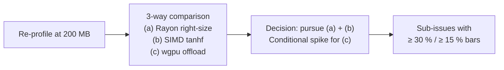

## Summary

Refreshes the scoring hot-spot baseline at the issue-target 200 MB corpus
size and captures the GPU adoption design as a planning artefact ahead of
any wgpu port. No production code changes — this PR ships docs and refreshed
flamegraph evidence only. Closes #79.

* `docs/performance-baseline.md` — appended a new "9 May 2026 (Issue #79,
  200 MB corpus)" section with Criterion medians for
  `score_from_json_fused/forward_only`,
  `score_from_creature_dir/creatures/{1,10,50,200}`, and
  `unpack_and_mse_inner/unpack_then_mse`, plus refreshed top-5 hot-spot
  tables for both the single-creature and 50-creature flamegraphs.
* `docs/gpu-scoring-design.md` — new design doc covering today's CPU
  pipeline, the three candidate strategies (Rayon right-size, SIMD
  `tanhf`, GPU offload via wgpu), per-chunk dispatch + transfer cost
  estimates, the smallest workload where GPU is expected to win
  (≈ 50 creatures × 200 MB), the chosen direction, and the acceptance
  benchmarks that gate the follow-up sub-issues.
* `docs/evidence/single-creature-200mb.svg` /
  `docs/evidence/multi-creature-200mb.svg` — fresh sample-based
  flamegraphs at the 200 MB corpus size. The earlier 2 GiB / 500 MB
  flamegraphs from Issue #37 are kept at `single-creature.svg` /
  `multi-creature.svg` for historical comparison.

## Evidence

### Reproducer

```bash
BENCH_SCORING_BYTES=200000000 ./scripts/run-benches.sh
PROFILE_SAMPLE_SECONDS=120 ./scripts/profile-flamegraph.sh \
  209715200 209715200 50
```

### 200 MB Criterion medians (Apple M4, 24 GB, macOS arm64, rustc 1.95.0)

| Bench | Median | Throughput |
|---|---|---|
| `score_from_json_fused/forward_only` | 89.871 ms | 2.07 GiB/s |
| `score_from_creature_dir/creatures/1` | 1.3292 s | 143.50 MiB/s |
| `score_from_creature_dir/creatures/10` | 636.00 ms | 299.90 MiB/s |
| `score_from_creature_dir/creatures/50` | 2.3423 s | 81.43 MiB/s |
| `score_from_creature_dir/creatures/200` | 6.3640 s | 29.97 MiB/s |
| `unpack_and_mse_inner/unpack_then_mse` | 586.82 µs | 1.04 GiB/s |

### GPU utilisation gap

Confirmed zero GPU work today — no `wgpu` dependency in
`rust_scorer/Cargo.toml`, no compute shader path in `stream_score.rs` /
`multi_score.rs`. Active-CPU shares at 200 MB:

| Hot leaf | Single-creature active % | Multi-creature N=50 active % |
|---|---|---|
| `tanhf` (incl. PLT stub) | ≈ 31 % | ≈ 48 % |
| `mse_sum_batch_packed` | 40.6 % | 30.4 % |
| `mse_sum_batch_4way` closure | 14.0 % | 18.1 % |

### Decision pipeline



### Acceptance bars set for follow-up sub-issues

* (a) Rayon right-size — ≥ 30 % median improvement on
  `score_from_json_fused/forward_only` at 200 MB and `swtch_pri` share in
  the refreshed flamegraph below 25 %.
* (b) SIMD `tanhf` — ≥ 15 % median improvement on
  `unpack_and_mse_inner/unpack_then_mse` and
  `score_from_creature_dir/creatures/{10,50,200}` at 200 MB; max-abs MSE
  drift < 1e-5 vs `f64::tanh`.
* (c) wgpu offload — only opens after (a)+(b) land. ≥ 30 % over the
  post-(b) baseline on `score_from_creature_dir/creatures/{50,200}` at
  200 MB.

## Test Plan

* `./quality.sh` — passes (shellcheck, workflow validators, codespell,
  cargo-deny, fmt, clippy, check, build, tests, doc with `-D warnings`,
  release build).
* `./scripts/spell-check.sh` — no typos.
* `BENCH_SCORING_BYTES=200000000 ./scripts/run-benches.sh` — full Criterion
  run completed with results recorded in
  `docs/performance-baseline.md` and the table above.
* `./scripts/profile-flamegraph.sh 209715200 209715200 50` — produced the
  `*-200mb.svg` flamegraphs committed under `docs/evidence/`.
* No new code paths added, so no new unit tests were added; existing
  tests continue to pass under `cargo test --workspace --all-features`.
