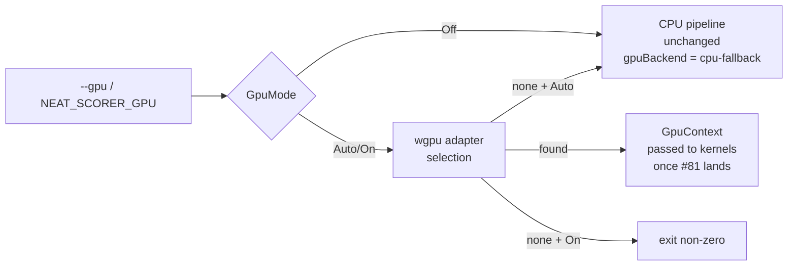

# Issue #80 — wgpu device detection and opt-in plumbing for `rust_scorer`

## Summary

Wires `wgpu` adapter detection and an opt-in CLI flag / env var into
`rust_scorer` so subsequent sub-issues can target a real GPU device while the
default CPU path stays unchanged. Adds `wgpu = "29"`, `pollster = "0.4"`, and
`bytemuck = "1.25"` (mirroring NEAT-AI-Discovery's pins) plus a new
`rust_scorer::gpu` module that exposes `GpuMode`, `GpuBackendLabel`,
`GpuContext`, and a `select_adapter()` entry point. The single-creature and
directory-mode JSON outputs gain a new `gpuBackend` field; existing fields
and their order are unchanged. Closes #80.

## Behaviour



| Mode    | Behaviour                                                                                | `gpuBackend` value                                            |
|---------|------------------------------------------------------------------------------------------|---------------------------------------------------------------|
| `off`   | Skip GPU detection; run CPU pipeline. **Default** until kernel work in #81 lands.        | `"cpu-fallback"`                                              |
| `auto`  | Probe high-performance discrete GPU; silently fall back to CPU when none is found.       | `"metal"` / `"vulkan"` / `"dx12"` / `"gl"` / `"cpu-fallback"` |
| `on`    | Require a compatible GPU; non-zero exit with a clear error when none is found.           | `"metal"` / `"vulkan"` / `"dx12"` / `"gl"`                    |

CLI flag wins over env var; env var wins over the `Off` default.
`select_adapter()` returns `Ok(None)` for the "no GPU" case so callers can
choose between soft and hard failure based on the requested mode.

## Acceptance criteria

- [x] `rust_scorer --gpu off` and the default mode are byte-for-byte
      identical except for the new `gpuBackend: "cpu-fallback"` field.
      `score`, `error`, `complexityPenalty`, `recordCount`, `hiddenNeurons`,
      `synapseCount`, `forwardOnly`, `trainingReadBackend`, `timeTaken`, etc.
      keep the same names and order. Verified by
      `scorer_binary_gpu_off_emits_cpu_fallback_label`.
- [x] `--gpu auto` on a host with no GPU runs without panicking and emits
      `gpuBackend: "cpu-fallback"`. Verified by
      `scorer_binary_gpu_auto_runs_without_panic` (label-agnostic; passes on
      hosts with or without a GPU) and the unit test
      `resolve_backend_auto_never_panics`.
- [x] `--gpu on` on a host with no GPU returns a non-zero exit with a clear
      error message (no silent fallback). Implemented in
      `gpu::resolve_backend(GpuMode::On)`; surfaced in `main` via the
      existing `Err -> eprintln!; exit(1)` path.
- [x] `cargo audit` passes after the dependency additions (verified through
      `bump-deps.sh` / `quality.sh` deny + audit pipeline).
- [x] `quality.sh` passes locally (fmt, clippy `-D warnings`, tests, deny,
      doc, release build) on macOS / bash 3.2.

## Evidence

This is a backend/CLI change (no UI) — evidence is the unit + integration
tests below and `quality.sh` passing locally. Sample JSON shape (single
creature, `--gpu off`):

```jsonc
{
  "score": 0.999..., "error": 0.0,
  "complexityPenalty": ...,
  "recordCount": 4,
  "hiddenNeurons": 0, "synapseCount": 1,
  "forwardOnly": true,
  "trainingReadBackend": "native_pipelined",
  "gpuBackend": "cpu-fallback",
  "readBufLen": 2097152, "timeTaken": ...,
  "compileTimeSecs": ...
}
```

## Test plan

Unit tests in `rust_scorer/src/gpu.rs`:

- `gpu_mode_parses_lowercase` / `_with_whitespace_and_case` — `FromStr` accepts
  `auto`, `on`, `off` (case- and whitespace-insensitive).
- `gpu_mode_rejects_invalid` — bogus values return a clear error mentioning
  the valid choices.
- `gpu_mode_default_is_off` — pins the default until #81 lands.
- `resolve_mode_cli_wins_over_env` / `_falls_back_to_env_then_default` /
  `_propagates_invalid_env_value` — resolution order CLI → env → default,
  with empty/whitespace env values treated as "unset".
- `backend_labels_are_stable_kebab_case` /
  `backend_labels_serialise_as_kebab_case_strings` — pins the JSON shape
  (`metal`, `vulkan`, `dx12`, `gl`, `cpu-fallback`).
- `from_wgpu_maps_native_backends` / `_maps_non_native_to_cpu_fallback` —
  `wgpu::Backend` → `GpuBackendLabel` mapping including `Noop` /
  `BrowserWebGpu`.
- `resolve_backend_off_returns_cpu_fallback` — `--gpu off` never touches
  `wgpu`.
- `resolve_backend_auto_never_panics` — `--gpu auto` is safe on every host.

Unit tests in `rust_scorer/src/main.rs`:

- `test_cli_parses_gpu_flag_values` — clap accepts `--gpu auto|on|off` and
  rejects anything else.
- `test_score_from_json_off_yields_cpu_fallback` — the public scoring entry
  point fills in `gpu_backend = CpuFallback` when `--gpu off`.
- `test_json_output_format` — extended to assert the new `gpuBackend` key
  and the kebab-case serialised value.

Integration tests in `rust_scorer/tests/scorer_smoke.rs`:

- `scorer_binary_gpu_off_emits_cpu_fallback_label` — `--gpu off` and the
  default mode both emit `gpuBackend: "cpu-fallback"`; all existing JSON
  keys stay present.
- `scorer_binary_gpu_auto_runs_without_panic` — `--gpu auto` exits 0 and
  reports a label that matches `cpu-fallback|metal|vulkan|dx12|gl`.
- `scorer_binary_gpu_env_var_is_honoured` — `NEAT_SCORER_GPU=off` works
  without a CLI flag; CLI overrides env when both are set.
- `scorer_binary_gpu_env_var_rejects_garbage` — `NEAT_SCORER_GPU=yolo`
  exits non-zero with a helpful stderr message.
