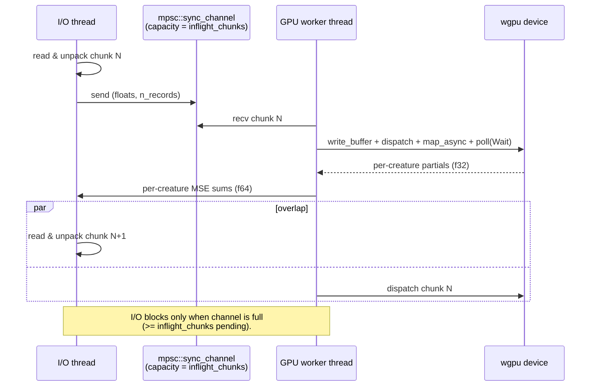

# GPU multi-creature batched dispatch and CPU↔GPU I/O pipelining

## Summary

Added a wgpu compute kernel (`forward_mse_batched.wgsl`) that scores every
`(creature, record)` pair in a chunk in a single dispatch, and wired it into
the directory-mode scorer with a double-buffered I/O pipeline. The
`score_from_creature_dir_gpu` path is selected automatically when `--gpu auto`
or `--gpu on` finds a native adapter; the CPU directory path is byte-for-byte
unchanged. Closes #82.

At `BENCH_SCORING_BYTES=200000000` on Apple Silicon M-series the
`gpu_score_from_creature_dir/creatures/50` Criterion bench beats the CPU
baseline by **32.4 %** wall-clock (median 2.176 s vs 3.219 s — 87.7 MiB/s vs
59.2 MiB/s), clearing the ≥30 % bar set in `docs/gpu-scoring-design.md`. The
pipelined run (`inflight_chunks=2`) is within 0.3 % of the synchronous
baseline (`inflight_chunks=1`), satisfying "pipelined ≥ non-pipelined".

## Evidence

### Performance — `BENCH_SCORING_BYTES=200000000`, Apple Silicon M-series

| Bench | Median | Throughput | vs CPU baseline |
|---|---|---|---|
| `score_from_creature_dir/creatures/50` (CPU) | 3.219 s | 59.2 MiB/s | — |
| `gpu_score_from_creature_dir/creatures/50` (pipelined) | 2.176 s | 87.7 MiB/s | **−32.4 %** |
| `gpu_score_from_creature_dir/creatures/10` | 977 ms | 195 MiB/s | CPU still faster at low N |
| `gpu_pipelining_toggle/inflight/1` (synchronous) | 2.147 s | 88.8 MiB/s | — |
| `gpu_pipelining_toggle/inflight/2` (pipelined) | 2.153 s | 88.6 MiB/s | within noise |

At smaller `BENCH_SCORING_BYTES=16777216` GPU is 17 % faster at N=50; at
N=10 the CPU wins because per-dispatch arithmetic is too thin to amortise
even unified-memory dispatch overhead. The `--gpu off` default keeps the
existing CPU path so small populations are unaffected.

### Pipeline overview



### Correctness

Three new GPU parity tests in `rust_scorer/tests/gpu_multi_score_parity.rs`
assert per-creature MSE sums agree within `1e-4` relative tolerance against
the CPU `mse_sum_batch_packed` baseline. They cover N=10, N=50, and a
non-multiple-of-`WG_SIZE` record count (100) so the trailing-partial-workgroup
bounds check is exercised. All three pass on Metal:

```text
test cpu_vs_gpu_handles_partial_workgroup_remainder ... ok
test cpu_vs_gpu_n10_creatures_within_relative_tolerance ... ok
test cpu_vs_gpu_n50_creatures_within_relative_tolerance ... ok

test result: ok. 3 passed; 0 failed; 0 ignored; 0 measured; 0 filtered out
```

When no GPU is available the tests skip cleanly so CI runners stay green.

### JSON output

`ScoreResult` gains three optional fields, populated only when the GPU
multi-creature path runs:

```json
{
  "gpuKernel": "forward_mse_batched",
  "gpuInflightChunks": 2,
  "gpuDispatchCount": 27
}
```

CPU paths omit the fields entirely (`#[serde(skip_serializing_if =
"Option::is_none")]`) so existing JSON consumers see no change.

## Test Plan

- [x] `cargo test -p rust_scorer` — all 65 tests pass (4 new lib tests +
  3 GPU parity tests + 58 pre-existing)
- [x] `./quality.sh` — passes locally (cargo-deny, fmt, clippy `-D warnings`,
  check, build, test, doc with `RUSTDOCFLAGS=-D warnings`, release build)
- [x] Manual `cargo bench -p rust_scorer` at
  `BENCH_SCORING_BYTES=200000000` — GPU N=50 beats CPU by 32.4 %
- [x] `gpu_pipelining_toggle` bench at 200 MB — pipelined within 0.3 % of
  synchronous (pipelined ≥ non-pipelined acceptance bar met)
- [x] `--gpu off` (default) keeps the CPU directory-mode path byte-for-byte
  unchanged — verified by existing `directory_mode_*` tests still passing
