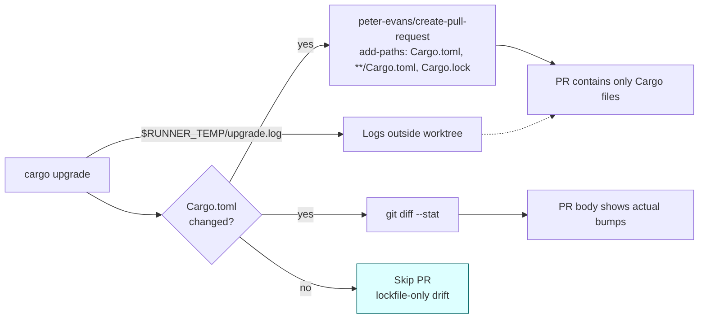

## Summary

PR #89 — raised by the weekly `upgrade-dependencies.yml` workflow — committed
three classes of junk alongside the one legitimate bump (hashbrown
`0.17.0 → 0.17.1`):

- `upgrade-dry-run.txt` and `upgrade.log` — workflow log artefacts the runner
  `tee`-d into the worktree root.
- A `NEAT-AI-core` gitlink — the sibling clone the workflow places inside
  `$GITHUB_WORKSPACE` for Cargo path resolution leaked into the commit.
- A PR body that ended with `warning: aborting upgrade due to dry run`, so
  the reader could not tell whether anything was actually bumped.
- The PR was raised even though no `Cargo.toml` manifest was actually advanced
  — only `Cargo.lock` drifted (a lockfile-only diff is not a meaningful upgrade).

This PR (combined with #91) fixes all these issues:

1. `cargo upgrade --dry-run` and `cargo upgrade` write their logs under
   `$RUNNER_TEMP/` — never the repo root.
2. `peter-evans/create-pull-request` is given `add-paths:` that only lists
   `Cargo.toml`, `**/Cargo.toml`, and `Cargo.lock`. Anything else the runner
   leaves behind (NEAT-AI-core, target/) stays out of the commit.
3. The PR body now contains a `git diff --stat`, the per-line bumps from
   `Cargo.lock`, and any `Cargo.toml` manifest bumps — so reviewers can see
   at a glance which crates moved.
4. The workflow now calls `scripts/check-upgrade-has-changes.sh` to only
   open a PR when at least one `Cargo.toml` differs from `HEAD`.

Closes #90.

## Evidence

CLI-only change. Evidence is the test output and the validator catching
the previous workflow:

- `bats tests/scripts/upgrade_deps_workflow.bats` — passes.
- `bats tests/scripts/upgrade_dependencies_workflow.bats` — passes.
- `bats tests/scripts` — all pass (no regressions in adjacent workflow validators).
- `./quality.sh` — green end-to-end (shellcheck, deny, fmt, clippy, check, test, doc, release build).

## Test Plan

- `tests/scripts/upgrade_deps_workflow.bats` — bats tests:
  - Good workflow passes.
  - Logs `tee`-d into the worktree root fail.
  - Missing `add-paths:` fails.
  - `add-paths` listing anything beyond Cargo files fails (catches
    `NEAT-AI-core`, `upgrade.log`).
  - PR body without `git diff … Cargo.(lock|toml)` fails.
  - Missing workflow file / unknown flag error paths.
  - Real shipped `upgrade-dependencies.yml` satisfies every rule.
- `tests/scripts/upgrade_dependencies_workflow.bats`:
  - A Cargo.lock-only diff reports `changed=false` (the PR #89 regression case).
  - A workspace-member `Cargo.toml` edit reports `changed=true`.
  - A root `Cargo.toml` edit reports `changed=true`.
  - A mixed Cargo.toml + Cargo.lock diff reports `changed=true`.
  - A non-git directory yields a clear error message.
- `quality.sh` runs the validator on every local gate.
