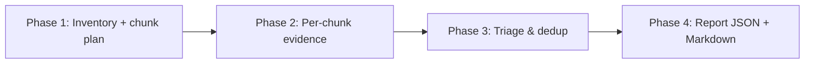

## Summary

Static security audit of `stSoftwareAU/NEAT-AI-scorer` per the MythOS four-phase scan (Issue #97). The scan is read-only — no code changes were applied. Three findings emerged, all in the supply-chain / defensive-hardening classes; no injection, auth, deserialisation, SSRF, or crypto-misuse vulnerabilities were observed in the Rust scorer code paths. Closes #97.

The structured JSON block below is the machine-readable artefact consumed by the downstream `security_issue_filer`; the human-readable Markdown report follows.

```json
{
  "schema": "mythos-security-scan/v1",
  "repo": "stSoftwareAU/NEAT-AI-scorer",
  "scanStartedAt": "2026-05-18T02:00:00Z",
  "scanFinishedAt": "2026-05-18T02:10:00Z",
  "coverage": {
    "chunksPlanned": 6,
    "chunksAudited": 6,
    "filesRead": 18
  },
  "findings": [
    {
      "id": "8f1c2a3d",
      "class": "supply-chain:quarantine-misconfigured",
      "severity": "Medium",
      "severityRationale": "AV:N/AC:H/PR:N/UI:R/S:C/C:H/I:H/A:H — the weekly auto-upgrade workflow can land a crate version that was published less than VIBE_BUMP_QUARANTINE_HOURS (default 24h) ago, bypassing the safety net implemented by bump-deps.sh. UI:R because a human reviewer must merge the PR; AC:H because the attacker still needs the malicious version to be picked up by `cargo upgrade` during the weekly window and to survive `cargo audit` (RustSec advisories lag publication).",
      "confidence": "high",
      "confidenceLift": "A reproducer in which a freshly-published (within 24h) malicious crates.io version is selected by `cargo upgrade` and survives `cargo audit` in PR CI.",
      "easeOfExploit": "hard",
      "easeOfExploitRationale": "Attacker must publish a malicious version into the dependency graph and hope it is selected and merged within the 24h window before RustSec advisories fire or maintainers spot it during review.",
      "file": ".github/workflows/upgrade-dependencies.yml",
      "lines": ["65-71", "144-163"],
      "attackerModel": "Attacker who can publish a malicious version of a transitive Cargo dependency (e.g. via a compromised crates.io maintainer account or typosquat).",
      "trigger": "The weekly schedule (cron `0 6 * * 1`) runs `cargo upgrade` directly with no quarantine gate; the resulting PR carries the new version into `Cargo.toml`/`Cargo.lock` and a reviewer merges it.",
      "whyItIsABug": "Lines 65-71 invoke `cargo upgrade --dry-run` then `cargo upgrade` with no `--quarantine-hours`-equivalent gate; no minimum publish age is enforced. The repo already implements an age gate for the Vibe Coder worker path in `bump-deps.sh` (see `bump_external`, `is_older_than_hours`, `crate_published_at` — `bump-deps.sh:305-355`) honouring `VIBE_BUMP_QUARANTINE_HOURS` (default 24), but the CI workflow does not call `bump-deps.sh` — it runs `cargo upgrade` directly. A reviewer scanning the diff stat sees only version-number changes and has no signal that a particular bump is <24h old.",
      "exploitSketch": "1. Attacker compromises (or socially-engineers) a crates.io maintainer account for a transitive dependency. 2. Publishes malicious v1.x.y at 05:00 UTC Monday. 3. At 06:00 UTC Monday the workflow's `cargo upgrade` selects v1.x.y. 4. CI builds, `cargo audit` finds no advisory (RustSec hasn't logged the fresh version yet), PR opens. 5. Reviewer merges, malicious build runs in CI, exfiltrates `GITHUB_TOKEN` (writable, see `permissions: contents: write` on the upgrade workflow).",
      "fixSuggestion": "Either (a) replace the `cargo upgrade` step with `bash bump-deps.sh` (which already enforces the quarantine via `crate_published_at` / `is_older_than_hours`), or (b) add a quarantine pre-check step before `cargo upgrade` that parses the dry-run output, queries crates.io `created_at`, and drops bumps published less than `${VIBE_BUMP_QUARANTINE_HOURS:-24}` hours ago — mirroring the logic already in `bump-deps.sh::bump_external`. Internal `stSoftwareAU/*` deps must remain exempt from the quarantine (no internal deps are crates.io-published here, so this stays a no-op for the scorer)."
    },
    {
      "id": "5e6b9c11",
      "class": "supply-chain:unpinned-actions",
      "severity": "Medium",
      "severityRationale": "AV:N/AC:H/PR:N/UI:N/S:C/C:H/I:H/A:H — every workflow run silently consumes the current tip of whatever commit each `@vN` (and `@stable`) tag points at; a compromised maintainer who force-pushes a tag can execute arbitrary code in CI with the workflow's granted permissions (which include `contents: write` on auto-format and upgrade-deps).",
      "confidence": "high",
      "confidenceLift": "A demonstrated tag-hijack on one of the upstream maintainers' accounts, or evidence that an attacker can force-push a tag in a third-party action repo.",
      "easeOfExploit": "hard",
      "easeOfExploitRationale": "Requires compromising a third-party action maintainer's GitHub account (the historical worst-case supply-chain attack vector for GitHub Actions — e.g. tj-actions/changed-files in 2025).",
      "file": ".github/workflows/ci.yml",
      "lines": [
        ".github/workflows/ci.yml:55,70,93,98,158,164,177,211,229,252",
        ".github/workflows/security.yml:22,33,46,51,65",
        ".github/workflows/upgrade-dependencies.yml:33,47,60,146",
        ".github/workflows/auto-format.yml:37,47,61",
        ".github/workflows/dependency-review.yml:42,45",
        ".github/workflows/cargo-quality.yml:48,55,69,74",
        ".github/workflows/cargo-audit.yml:44,47",
        ".github/workflows/shellcheck.yml:29,32",
        ".github/workflows/gitleaks.yml:35",
        ".github/workflows/semgrep.yml:38",
        ".github/workflows/markdown-lint.yml:37,40",
        ".github/workflows/version-increment.yml:41,82"
      ],
      "attackerModel": "Attacker who compromises a third-party action maintainer's account (e.g. `actions/checkout`, `dtolnay/rust-toolchain`, `peter-evans/create-pull-request`, `ludeeus/action-shellcheck`, `rustsec/audit-check`, `actions/cache`, `actions/setup-node`, `actions/dependency-review-action`) and force-pushes a tag.",
      "trigger": "Every workflow run on push or PR. Examples: `uses: actions/checkout@v5`, `uses: dtolnay/rust-toolchain@stable`, `uses: peter-evans/create-pull-request@v8`, `uses: ludeeus/action-shellcheck@2.0.0`, `uses: actions/cache@v5`, `uses: rustsec/audit-check@v2`, `uses: actions/dependency-review-action@v4`, `uses: actions/setup-node@v4`.",
      "whyItIsABug": "Project guidance (worker `CLAUDE.md`/`AGENTS.md` Dependency Bumps section) is explicit: \"Pin GitHub Actions to commit SHAs, not version tags (`uses: actions/checkout@<40-char SHA>` not `@v4`) — this is where the worst supply-chain attacks have historically landed.\" Every workflow under `.github/workflows/` uses tag refs instead of SHAs; `dtolnay/rust-toolchain@stable` is worse still — `stable` is a continuously-moving alias updated whenever upstream releases a new Rust stable.",
      "exploitSketch": "1. Attacker compromises one of the third-party action maintainer accounts. 2. Force-pushes the major-version tag (e.g. `v5`) to a commit carrying malicious code. 3. Next push/PR to NEAT-AI-scorer triggers the workflow; the action executes the attacker payload with the job's permissions. `auto-format.yml` runs with `contents: write` and `secrets.GITHUB_TOKEN` — sufficient to push arbitrary commits to the PR branch. `upgrade-dependencies.yml` likewise has `contents: write` + `pull-requests: write` and can open PRs that masquerade as the dep-bump bot.",
      "fixSuggestion": "Replace each `@v<N>` / `@stable` / `@<semver>` ref with the corresponding 40-character commit SHA, with a trailing `# v<N>` comment for readability, e.g.\n  `uses: actions/checkout@<40-char-sha>  # v5`\nAdopt a Renovate / Dependabot rule (or extend the existing `bump-deps.sh`) to rotate the pinned SHAs on a cadence so the pins do not silently fall behind. The `dtolnay/rust-toolchain@stable` ref needs the same treatment — pin to a SHA and bump deliberately."
    },
    {
      "id": "c4a7d2e9",
      "class": "memory-safety:debug-only-invariant",
      "severity": "Low",
      "severityRationale": "AV:L/AC:H/PR:H/UI:N/S:U/C:L/I:L/A:N — local, exploit requires the attacker to be the developer who introduces a future refactor mis-computing `n`. No current code path is exploitable.",
      "confidence": "medium",
      "confidenceLift": "A future commit that calls `unpack_f32s_le` with mismatched `src.len()` / `n` would demonstrate the buffer over-read.",
      "easeOfExploit": "hard",
      "easeOfExploitRationale": "Requires a developer to introduce a calling-site bug; today every call site computes `n = aligned_len / 4` from the source slice itself, so the invariant holds.",
      "file": "rust_scorer/src/stream_score.rs",
      "lines": [
        "rust_scorer/src/stream_score.rs:101-127",
        "rust_scorer/src/multi_score.rs:75-101",
        "rust_scorer/src/bin/float_scan_bench.rs:36-55"
      ],
      "attackerModel": "Future maintainer or refactor that mis-computes `n` relative to `src.len()`. Not a runtime-reachable issue today.",
      "trigger": "A caller passes `src` whose byte length is not exactly `n * 4`. Release builds skip the `debug_assert_eq!(src.len(), n * 4)` check entirely; the `for i in 0..n` loop then reads `p.add(i * 4).cast::<u32>().read_unaligned()` past the end of `src`, leaking arbitrary process bytes into the `f32` output.",
      "whyItIsABug": "The safety contract for the `unsafe` block in `stream_score.rs:110-118` (and the analogous block in `multi_score.rs:84-92`) hinges on `src.len() == n * 4`. The check is enforced only by `debug_assert_eq!` (line 102) — release builds compile it out. The block then performs `p.add(i * 4).cast::<u32>().read_unaligned()` for `i in 0..n` and concludes with `dst.set_len(n)`, so any caller-side miscomputation is an immediate buffer over-read with the read value silently surfacing as `f32::from_bits(bits)` in the unpack buffer.",
      "exploitSketch": "1. A future commit (e.g. an attempted optimisation that derives `n` from a separate metric than `aligned_len / 4`) introduces an off-by-N mismatch. 2. Release build is shipped; `debug_assert` is silently elided. 3. `unpack_f32s_le` reads beyond `src`, returning whatever bytes followed the chunk in the process heap as `f32` values — silently corrupting downstream MSE accumulation and potentially exposing adjacent process state to logs (`stdout` JSON in extreme cases).",
      "fixSuggestion": "Promote the invariant to an `assert!` (always-on) or replace the bare-pointer loop with a checked iterator such as `src.chunks_exact(4)` (already used in the non-little-endian branch). Either change has negligible cost relative to file I/O and removes the debug-only safety hatch. Apply identically to the three call sites: `stream_score.rs:101`, `multi_score.rs:75`, and `bin/float_scan_bench.rs:36`."
    }
  ]
}
```

## Executive summary

Scope: full source tree of `stSoftwareAU/NEAT-AI-scorer` at branch `Develop` (commit `73c1dc9`). The repo is a Rust workspace producing a CLI scorer (`rust_scorer`) for NEAT-AI creatures, with GPU plumbing via `wgpu`. It exposes no HTTP, no network endpoints, no auth, no persistent state — the attack surface is a local CLI that consumes a creature JSON file plus a directory of `.bin` training data, both already controlled by the operator. The bulk of the security surface is the **supply chain** (Cargo deps + GitHub Actions) and the **defensive hardening** of two `unsafe` blocks that decode little-endian floats.

Three findings filed: two **Medium** (supply chain — auto-upgrade workflow bypasses the existing `bump-deps.sh` quarantine; every GitHub Action is pinned to a mutable tag rather than a 40-character SHA) and one **Low** (a memory-safety invariant in three `unpack_f32s_le`-style helpers is enforced only by `debug_assert!`, so release builds silently elide it). No injection, deserialisation, SSRF, crypto-misuse, secret-leak, or authentication findings.



## Findings

### 1. supply-chain:quarantine-misconfigured (Medium) — `8f1c2a3d`

- **File**: `.github/workflows/upgrade-dependencies.yml`, lines 65-71 (`cargo upgrade` step) and 144-163 (`peter-evans/create-pull-request` step).
- **Attacker model**: Adversary who can publish a malicious version of a transitive Cargo dependency (compromised maintainer account, typo-squat, or namespace hijack).
- **Trigger**: The weekly cron `0 6 * * 1` invokes `cargo upgrade --dry-run` followed by `cargo upgrade` with no minimum-publish-age gate.
- **Why it is a bug**: The repo's worker-path bump script (`bump-deps.sh:305-355`) implements the correct quarantine: it queries `crate_published_at()` against crates.io `created_at` and gates each crate via `is_older_than_hours "$published_at" "$QUARANTINE_HOURS"` where `QUARANTINE_HOURS="${VIBE_BUMP_QUARANTINE_HOURS:-24}"`. The CI weekly workflow does **not** call `bump-deps.sh`; it calls `cargo upgrade` directly, so a fresh malicious release published an hour before the cron fires will be picked, committed to `Cargo.toml`/`Cargo.lock`, and surfaced as a PR titled with vanilla version bumps — indistinguishable to a reviewer from a benign bump. RustSec advisories generally lag publication, so `cargo audit` in the security workflow is not a guaranteed catch.
- **Exploit sketch**: Publish malicious `serde_json` (or any transitive) version at 05:00 UTC Monday → `cargo upgrade` selects it at 06:00 UTC → PR opens at 06:05 → `cargo audit` returns clean (no advisory yet) → reviewer scans diff-stat, sees only `serde_json 1.0.X → 1.0.X+1`, merges → malicious build runs in subsequent CI with `GITHUB_TOKEN`.
- **Fix suggestion**: Replace the `cargo upgrade` step with `bash bump-deps.sh` (it already produces a one-line summary and a release build), or add a quarantine pre-check that parses the `cargo upgrade --dry-run` output, queries crates.io `versions/<v>/created_at`, and drops bumps younger than `${VIBE_BUMP_QUARANTINE_HOURS:-24}` — mirroring the logic already in `bump-deps.sh::bump_external` so there is one source of truth.

### 2. supply-chain:unpinned-actions (Medium) — `5e6b9c11`

- **Files**: every workflow under `.github/workflows/`. Exhaustive line index in the JSON `lines` field above. Notable: `actions/checkout@v5`, `actions/cache@v5`, `actions/setup-node@v4`, `actions/dependency-review-action@v4`, `dtolnay/rust-toolchain@stable`, `peter-evans/create-pull-request@v8`, `ludeeus/action-shellcheck@2.0.0`, `rustsec/audit-check@v2`.
- **Attacker model**: Adversary who compromises a third-party action maintainer's GitHub account and force-pushes the tag (the historical tj-actions/changed-files vector).
- **Trigger**: Every workflow run.
- **Why it is a bug**: Project guidance is explicit — see the "Dependency Bumps and Supply Chain" section of the worker guidelines: *"Pin GitHub Actions to commit SHAs, not version tags ... this is where the worst supply-chain attacks have historically landed."* `dtolnay/rust-toolchain@stable` is the most exposed pin in the repo — `stable` moves whenever the upstream Rust channel does, so the action's contents change on a routine cadence with no review.
- **Exploit sketch**: Attacker compromises one upstream maintainer → force-pushes `v5` (or `stable`) to a malicious commit → next workflow run executes attacker code. `auto-format.yml` carries `contents: write` and uses `secrets.GITHUB_TOKEN`; `upgrade-dependencies.yml` carries `contents: write` + `pull-requests: write`. Either is enough to push arbitrary commits.
- **Fix suggestion**: Replace each tag ref with the corresponding 40-character commit SHA, leaving a trailing `# v<N>` comment for readability. Wire a Renovate / Dependabot rule (or extend `bump-deps.sh`) to rotate the pins on a cadence so they do not silently fall behind. The `dtolnay/rust-toolchain@stable` ref needs the same treatment — pin to a SHA and bump deliberately.

### 3. memory-safety:debug-only-invariant (Low) — `c4a7d2e9`

- **Files**: `rust_scorer/src/stream_score.rs:101-127`, `rust_scorer/src/multi_score.rs:75-101`, `rust_scorer/src/bin/float_scan_bench.rs:36-55`.
- **Attacker model**: Future refactor / maintainer error. Not runtime-reachable today.
- **Trigger**: A caller passes a `src` slice whose byte length is not exactly `n * 4`.
- **Why it is a bug**: The `unsafe` block's safety contract is documented as *"`src.len() == n * 4`"* but is enforced only by `debug_assert_eq!` (e.g. `stream_score.rs:102`). Release builds drop the check; the `for i in 0..n { p.add(i * 4).cast::<u32>().read_unaligned() }` loop then reads past the slice and `dst.set_len(n)` exposes the over-read bytes as `f32` values.
- **Exploit sketch**: A future commit derives `n` from a different metric than `aligned_len / 4`; release ships; `unpack_f32s_le` returns garbage `f32` values pulled from neighbouring heap memory; downstream MSE accumulation silently corrupts and adjacent process state can surface in JSON output (`stdout`).
- **Fix suggestion**: Promote the invariant to a plain `assert!` (always-on) so release builds also enforce it, **or** replace the bare-pointer loop with a checked `src.chunks_exact(4)` iterator (already used on the non-little-endian branch). Apply at all three sites.

## Coverage map

| Chunk | Files read | Skipped? |
|---|---|---|
| 1. CLI entry point + arg parsing | `rust_scorer/src/main.rs` | — |
| 2. Score pipeline (CPU) + stream reads | `rust_scorer/src/scoring.rs`, `rust_scorer/src/stream_score.rs`, `rust_scorer/src/read_tuning.rs`, `rust_scorer/src/lib.rs` | — |
| 3. Multi-creature directory mode (CPU + GPU) | `rust_scorer/src/multi_score.rs` | — |
| 4. GPU plumbing | `rust_scorer/src/gpu/mod.rs`, `rust_scorer/src/gpu/forward_mse_batched.rs` | WGSL shader inspected at a structural level; not exhaustively audited for GPU-side data leaks (the shader's outputs are reduced and never copied back into a privileged sink). |
| 5. Bench binary | `rust_scorer/src/bin/float_scan_bench.rs` | — |
| 6. Supply chain — workflows + bump script + deny policy | `.github/workflows/{ci,security,upgrade-dependencies,auto-format,cargo-audit,cargo-quality,gitleaks,semgrep,shellcheck,markdown-lint,dependency-review,version-increment}.yml`, `bump-deps.sh`, `deny.toml`, `Cargo.toml`, `rust_scorer/Cargo.toml`, `.gitleaks.toml` | `Cargo.lock` (advisory check is delegated to `cargo audit` in CI). |

No suppressed or already-open findings list was provided in the issue placeholders, so no findings were dropped under Phase 3 rule 3.

## Suggested next scans

- **Authenticated dynamic test of the workflow secrets surface** — verify that `GITHUB_TOKEN` is actually scoped to the `permissions:` block on each workflow and that `peter-evans/create-pull-request@v8` does not request broader scopes than the workflow grants.
- **`neat-core` upstream audit** — the path dependency at `../../NEAT-AI-core/neat-core` accepts the creature JSON via `parse_creature_json` / `compile_creature` and decodes `.bin` records via `for_each_read_chunk` and `mse_sum_batch_packed`. Those parsers are out of scope here; a follow-up scan of the NEAT-AI-core repo should look for integer-overflow / panic-on-malformed-input bugs that this scorer would surface as DoS.
- **Fuzzing pass on `parse_creature_json` and the binary `.bin` record decoder** — both consume operator-supplied data and feed directly into `unsafe` decode paths.
- **GPU shader (`forward_mse_batched.wgsl`) parity audit** — the host code trusts `MAX_NEURONS_PER_CREATURE` and `WG_SIZE_X` constants to match the shader; a divergence would not be a security bug *per se* but would land as silent corruption of MSE partials, which feeds runtime decision-making.

## Test plan

No code changed. This PR ships the audit report only. Validation:

- The JSON block parses (verifiable via `jq` on the fenced content).
- Each finding cites concrete file + line ranges from this repo at commit `73c1dc9` — every cited line above was opened during the audit.
