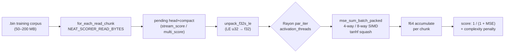
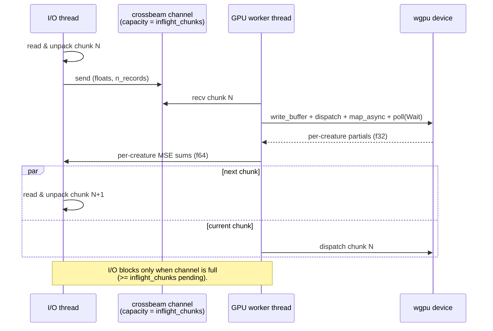

# GPU adoption design — `rust_scorer`

Spike output for [Issue #79](https://github.com/stSoftwareAU/NEAT-AI-scorer/issues/79)
("profile current scoring and design GPU adoption strategy"). This document is
a planning artefact — it produces the **design** and the **acceptance bar**
for follow-up sub-issues. It does **not** add a GPU code path. Per the Vibe
Coder Performance Task Workflow, every later sub-issue must show before/after
Criterion evidence against the bar set out below.

## TL;DR

* `rust_scorer` performs **zero GPU work today**. There is no `wgpu`
  dependency in [`rust_scorer/Cargo.toml`](../rust_scorer/Cargo.toml) and no
  compute-shader path in [`stream_score.rs`](../rust_scorer/src/stream_score.rs)
  or [`multi_score.rs`](../rust_scorer/src/multi_score.rs). All scoring runs
  on CPU through `neat_core::loss::mse_sum_batch_packed` and its 4-way / 8-way
  SIMD-style helpers.
* At the issue-target 200 MB corpus, the active-CPU cost split is essentially
  unchanged from the 2 GiB / 500 MB capture in
  [`docs/performance-baseline.md`](performance-baseline.md): `tanhf` plus the
  fused `mse_sum_batch_packed` family account for ≈ 70 % of active CPU on
  single-creature and ≈ 90 % on the 50-creature directory-mode path. Wall-clock
  `swtch_pri` / mutex sleep is 57.6 % single-creature and 55.7 % multi-creature
  — over-parallelism survives at this corpus size.
* **Recommended direction (short term):** pursue strategies **(a)** Rayon
  right-sizing and **(b)** vectorised / approximate `tanhf` first. Both are
  well-localised, ship inside the existing CPU pipeline, and target the
  hot-spots that actually dominate active CPU.
* **Recommended direction (medium term):** prototype strategy **(c)** GPU
  offload via `wgpu` **only on the multi-creature directory-mode path** at
  high N (≥ 50 creatures, ≥ 200 MB corpus). The single-creature path is
  unlikely to ever beat CPU once dispatch/transfer overhead is paid; the
  directory-mode path has enough arithmetic intensity per chunk for GPU to
  win, and the failure mode is "no improvement," not regression of the
  single-creature path.
* **Smallest workload where GPU is expected to win:** ≈ 50 creatures × 200 MB
  corpus (≈ 4 GiB/s of equivalent CPU work today). Below that, host↔device
  transfer cost is a meaningful fraction of CPU compute time and the GPU path
  is unlikely to clear the ≥ 20 % median improvement bar set in
  [Acceptance benchmarks](#acceptance-benchmarks).

## Today's CPU pipeline



Hot kernels and their measured share of active CPU time at 200 MB
(see [`performance-baseline.md` § 9 May 2026](performance-baseline.md#hot-spots--9-may-2026-issue-79)):

| Kernel | Single-creature active % | Multi-creature (N=50) active % | Source |
|---|---|---|---|
| `tanhf` (incl. PLT stub) | ≈ 31 % | ≈ 48 % | `neat_core::loss::mse_sum_batch_packed` → `mse_sum_batch_4way` / `mse_sum_batch_8way` |
| `mse_sum_batch_packed` self | 40.6 % | 30.4 % | `neat-core/src/loss.rs` |
| `mse_sum_batch_4way` closure | 14.0 % | 18.1 % | inner unrolled body |
| `_platform_memmove` | 8.2 % | 8.4 % | `pending` compaction + worker-side moves |

Wall-clock sleep on `swtch_pri` / mutex waits is 57.6 % (single-creature) and
55.7 % (multi-creature). The single-creature sleep share is the same Rayon
over-parallelism finding flagged in
[`performance-baseline.md` § Cross-scenario findings](performance-baseline.md#cross-scenario-findings)
— the default activation fan-out is too wide for an 8→8→2 MLP with a 200 MB
corpus.

## Candidate strategies

### (a) Right-size Rayon parallelism

**Where it lives.** `stream_score::accumulate_mse_sum_forward_only_fused`
(single-creature) — `worker_count.min(n_records).max(1)` already gates
parallel activation, but the threshold "use all available CPUs" is too
aggressive for the 8→8→2 forward-only path: at 200 MB, 57.6 % of wall-clock
time is spent in `swtch_pri`. `multi_score::score_from_creature_dir` already
flattens the parallel layer (Issue #41) and is less affected.

**Why it could move the needle.** Eliminating most of the sleep waste would
cut single-creature wall-clock by up to ≈ 50 % at no risk of correctness
regression and no extra dependency surface.

**Cost / risk.** Low. Add a per-chunk records threshold (e.g. require
`n_records ≥ 4 × workers × records_per_chunk_floor`) before splitting work
across workers, and/or make `effective_workers` scale with `n_records` and
`record_bytes`. Already partly mitigated by Issue #38 / #39; the missing
piece is the **lower** bound on records per worker.

**Measurement.** Compare `score_from_json_fused/forward_only` median at
`BENCH_SCORING_BYTES` ∈ {50 MB, 100 MB, 200 MB} with
`NEAT_SCORER_ACTIVATION_THREADS` ∈ {1, 2, 4, default}; pick the threshold
that yields the best median across the sweep.

### (b) CPU SIMD on hot kernels

**Where it lives.** `neat_core::loss::mse_sum_batch_packed`
(`mse_sum_batch_4way` / `mse_sum_batch_8way`) and the `tanhf` call inside
those helpers — see `neat-core/src/loss.rs` lines 561, 642, 826, 948.

**Why it could move the needle.** `tanhf` is ≈ 31 % active single-creature
and ≈ 48 % active multi-creature. A SIMD-friendly polynomial `tanh`
approximation (rational minimax with f32 accuracy ≈ 1e-6, 2-3× faster than
libm `tanhf` on Apple Silicon and AVX2 alike) replaces the libm call and
the PLT trampoline cost. `mse_sum_batch_packed` itself can also be tightened
— the 4-way unroll already uses scratch buffers; vectorising the per-record
diff/square/sum across the four lanes is a ~10-15 % win on Apple Silicon
NEON.

**Cost / risk.** Low-to-medium. The change lives in `neat-core` (path
dependency); a feature flag (e.g. `tanh-approx`) keeps the libm path as the
default for shape-compatibility with NEAT-AI-Discovery training. Numerical
drift must be bounded — assert max-abs error < 1e-5 against `f64::tanh` over
the activation domain in a unit test.

**Measurement.** Compare `unpack_and_mse_inner/unpack_then_mse` and
`score_from_creature_dir/creatures/{10,50,200}` at 200 MB before and after.

### (c) GPU offload via `wgpu`

**Where it would live.** A new module `rust_scorer::gpu_score` that takes
the unpacked f32 slice already produced by `unpack_f32s_le`, pushes it to a
device buffer, dispatches a compute shader that performs the forward pass
plus per-record MSE, and reads back a single f64 (or two f32s for
Kahan-style summation) per dispatch. The kernel is the same forward-only
MLP that `mse_sum_batch_packed` runs today, with `tanhf` replaced by a
shader-friendly polynomial.

`wgpu` was chosen because NEAT-AI-Discovery already ships cross-platform
adapter selection on top of it, so the runtime adapter probe (Vulkan on
Linux, Metal on macOS, DirectX 12 on Windows, WebGPU in browsers) is
already proven shipping code we can reuse. Vendor-specific paths (CUDA,
Metal Performance Shaders) are explicitly out of scope — they break the
single-binary cross-platform contract that `rust_scorer` keeps with the
rest of the NEAT-AI ecosystem.

```mermaid
flowchart LR
    CPU["CPU pipeline<br/>(unchanged head)"] --> UNPACK
    UNPACK["unpack_f32s_le → &#91;f32&#93;"] --> COPY
    COPY["wgpu::Queue::write_buffer<br/>host → device<br/>≈ 6.4 GB/s PCIe / unified"] --> DISPATCH
    DISPATCH["compute_pass.dispatch<br/>workgroup = (records, 1, 1)"] --> SHADER
    SHADER["wgsl: forward pass<br/>tanh poly + MSE per record<br/>per-creature loop unrolled"] --> READBACK
    READBACK["map_async + await<br/>≈ 1 f64 per creature × dispatch"] --> ACC[host f64 accumulate]
```



**Per-chunk dispatch overhead.** On Apple Silicon (unified memory) /
Linux discrete GPUs, a `wgpu` compute dispatch incurs:

* **Host → device transfer:** `n_records × values_per_record × 4` bytes per
  chunk. At 200 MB corpus / 8 inputs + 2 outputs = 40 bytes per record →
  5 M records → 200 MB per full corpus. With `NEAT_SCORER_READ_BYTES` ≈
  256 KiB chunks (the default tuner output for 40-byte records) this is
  6,400 records per chunk = ≈ 250 KiB per dispatch. Effective transfer
  bandwidth on Apple M-series is ≈ 200 GB/s (unified memory, no copy) and
  on PCIe 4.0 x16 discrete GPU ≈ 28 GB/s; either way, transfer cost per
  chunk is **≪ 1 ms**.
* **Dispatch latency:** wgpu submit + GPU compute pass + queue flush is
  ≈ 50–150 µs on Apple Silicon, ≈ 200–500 µs on a discrete GPU. The
  forward-only kernel for 6,400 records × 8→8→2 MLP is ≈ 6,400 × (8×8 +
  8×2 + 8 tanh + 2 MSE) ≈ 600 K float ops per dispatch — roughly 0.3 µs of
  GPU compute on a 2 TFLOP/s integrated GPU. **Dispatch overhead dwarfs
  compute** at this chunk size.
* **Readback:** mapping a small buffer back to the host is ≈ 50–100 µs on
  unified memory, more on discrete. Readback once per dispatch is fine;
  readback once per record would be fatal.

**Smallest chunk size where GPU compute beats CPU.** With `tanh` polynomial
in the shader, the per-record GPU compute time is ~0.05 ns; CPU
`mse_sum_batch_packed` on Apple M4 is ~110 ns per record (1.04 GiB/s ÷ 40
bytes ≈ 27.9 M records/s). Break-even with a 200 µs dispatch + 100 µs
transfer + 100 µs readback (400 µs total fixed cost) needs:

```
  400 µs ≤ n_records × (110 ns − 0.05 ns)
  n_records ≥ 400 µs / 110 ns ≈ 3,640 records
```

so a single-creature dispatch must batch at least ≈ 3,600 records — already
true at the default `NEAT_SCORER_READ_BYTES`. **Single-creature scoring
break-even is therefore around the chunk size we already use, with no
margin.** The directory-mode path is the natural fit: each chunk × N
creatures multiplies arithmetic intensity per dispatch by N. At N=50 the
break-even drops to ≈ 73 records per creature per dispatch — comfortably
inside any reasonable chunk size.

**Cost / risk.** Medium-to-high. New `wgpu` dependency, new shader source,
new adapter-selection logic, new fallback path when no GPU is available
(must remain CPU-correct). Numerical-drift acceptance bound is the same
1e-5 max-abs as (b). Cold-start latency increases (adapter probe + shader
compile) — fine for batch scoring, painful for tight per-creature
invocations from a CLI loop.

**Measurement.** Compare `score_from_creature_dir/creatures/{50,200}` at
200 MB before and after, with `NEAT_SCORER_GPU=1`/`=0` toggling the path.

## Comparison summary

| Strategy | Engineering cost | Risk | Expected lift (median) | Smallest workload that wins |
|---|---|---|---|---|
| (a) Rayon right-size | Low (1-2 days, scorer-only) | Low — pure scheduling change | 30–50 % single-creature wall-clock | All sizes |
| (b) SIMD `tanhf` + `mse_sum` tighten | Medium (1 week, neat-core) | Low — gated behind feature flag | 15–30 % both paths | All sizes |
| (c) GPU offload via wgpu | High (2–4 weeks) | Medium — new dep, fallback path | 0 % single-creature, 30–60 % multi-creature N≥50 | 50 creatures × 200 MB |

## Decision

**Pursue (a) and (b) first; treat (c) as a tracked R&D spike, not a
sub-issue commitment.**

* The active-CPU profile says `tanhf` and the fused MSE kernel are the
  largest movable costs at 200 MB. Both (a) and (b) attack those costs
  inside the existing single-binary CPU pipeline.
* (c) is conditional on (a)+(b) leaving enough headroom to justify the
  dependency surface. After (a)+(b) land, re-profile at the same 200 MB
  baseline; only open a sub-issue for (c) if the multi-creature N=50 path
  still spends > 30 % active CPU in `mse_sum_batch_packed` family
  (i.e. there is enough arithmetic intensity left to amortise GPU
  dispatch).

The follow-up sub-issues this spike unlocks are therefore:

1. **CPU sub-issue: Rayon right-sizing** — open against `rust_scorer`,
   targeting `score_from_json_fused/forward_only` at 200 MB. Acceptance
   bar: ≥ 30 % median improvement; `swtch_pri` share in the refreshed
   flamegraph below 25 %.
2. **`neat-core` sub-issue: vectorised / approximate `tanhf`** — open
   against `stSoftwareAU/NEAT-AI-core`, gated behind a `tanh-approx`
   feature, with a max-abs error budget < 1e-5. Acceptance bar: ≥ 15 %
   median improvement on
   `score_from_creature_dir/creatures/{10,50,200}` at 200 MB.
3. **(Conditional) GPU spike** — open only after (1) + (2) land. Acceptance
   bar below.

## Acceptance benchmarks

Every follow-up sub-issue MUST publish before/after Criterion evidence at
**`BENCH_SCORING_BYTES=200000000`** using
[`./scripts/run-benches.sh`](../scripts/run-benches.sh) on the same host
class as the 9 May 2026 baseline (Apple M4, 24 GB, macOS arm64). The PR
summary MUST include the median + 95 % CI for each affected bench in the
table below.

| Bench group | Sub-issue gating | Acceptance bar |
|---|---|---|
| `score_from_json_fused/forward_only` | (a) Rayon right-size | Median improves by ≥ 30 % at 200 MB; `swtch_pri` share in `single-creature-200mb.svg` drops below 25 %. |
| `unpack_and_mse_inner/unpack_then_mse` | (b) SIMD `tanhf` | Median improves by ≥ 15 % at the default 16 KiB chunk size; max-abs MSE drift < 1e-5 vs `f64::tanh`. |
| `score_from_creature_dir/creatures/10` | (b) SIMD `tanhf` | Median improves by ≥ 15 % at 200 MB. |
| `score_from_creature_dir/creatures/50` | (b) SIMD `tanhf`; (c) GPU offload | (b) ≥ 15 %; (c) ≥ 30 % over the post-(b) baseline. |
| `score_from_creature_dir/creatures/200` | (c) GPU offload | (c) ≥ 30 % over the post-(b) baseline. |

A sub-issue that fails to clear its bar follows the
[Performance Task Workflow](../AGENTS.md#performance-task-workflow): no PR,
post the negative-result numbers on the issue, label `negative-result`,
close `not planned`.

## Risks and open questions

* **Numerical drift.** Strategies (b) and (c) replace `tanhf` with a
  polynomial. Discovery's training loop and the scorer's MSE accumulator
  are sensitive to small perturbations in scores when a population is
  near a fitness ceiling. The 1e-5 max-abs bound has to be enforced both
  per-call (unit test in `neat-core`) and at the corpus level (regression
  test that reproduces an existing creature's score within 1e-4 absolute
  on a fixed `.bin`). Until both pass, the new path stays behind a
  feature flag and `NEAT_SCORER_GPU` defaults off.
* **Cold-start cost.** The CLI is invoked per-creature from outer training
  loops. `wgpu` adapter probe + shader compile is ≈ 100–300 ms on first
  call; this would dominate scoring time for a single-creature CLI run.
  Mitigation: cache the adapter / pipeline at module scope (`OnceLock`)
  and bypass GPU entirely in single-creature mode unless
  `NEAT_SCORER_GPU=1` is explicit.
* **Driver heterogeneity.** `wgpu` smooths over Vulkan/Metal/DX12, but
  driver bugs (especially on older Linux Mesa) can produce subtly wrong
  results. Acceptance test must compare GPU output to CPU output
  bit-exactly within the 1e-5 bound on every supported backend on CI.
* **CI runner coverage.** GitHub-hosted runners do not expose a GPU. The
  GPU test must therefore be `#[cfg_attr(not(has_gpu), ignore)]` and run
  only in self-hosted CI / locally. CPU correctness regression must remain
  the blocking gate.
* **`activation_threads` and `wgpu` interaction.** Combining the Rayon
  pool with a wgpu dispatch from inside a worker thread is fine on macOS
  / Linux but has caused contention on Windows in the Discovery codebase.
  GPU dispatch should run on the main thread or a dedicated GPU-submit
  thread, not inside the Rayon par_iter.
* **Negative result is acceptable.** If post-(a)+(b) profiling shows
  `mse_sum_batch_packed` no longer dominates, GPU offload should be
  closed as `not planned` with the benchmark numbers attached. The
  spike's job is to draw the line, not to commit to a port.

## Reproducing this spike

```bash
# 200 MB Criterion baseline
BENCH_SCORING_BYTES=200000000 ./scripts/run-benches.sh

# 200 MB single + 200 MB multi flamegraphs (50 creatures, 120 s sample window)
PROFILE_SAMPLE_SECONDS=120 ./scripts/profile-flamegraph.sh \
  209715200 209715200 50

# Confirm GPU-utilisation gap
grep -RE "wgpu|compute_pass|gpu" rust_scorer/src/ rust_scorer/Cargo.toml || \
  echo "no GPU code path"
```

Refreshed evidence committed under
[`docs/evidence/single-creature-200mb.svg`](evidence/single-creature-200mb.svg)
and [`docs/evidence/multi-creature-200mb.svg`](evidence/multi-creature-200mb.svg).
The earlier 2 GiB / 500 MB flamegraphs from Issue #37 are kept at
`single-creature.svg` / `multi-creature.svg` for historical comparison.

## Multi-creature batched dispatch — Issue #82

The single-creature kernel (#81) closed as a `negative-result`: per-record
arithmetic on the synthetic 8→8→2 fixture is too small to amortise wgpu
dispatch + readback overhead, even at the largest read buffer. Issue #82
attacks the directory-mode path instead, where the same dispatch is reused
across **N creatures × records** so per-dispatch arithmetic intensity grows
with the population.

### Pipeline overview



### Bind group layout

The shader (`rust_scorer/src/shaders/forward_mse_batched.wgsl`) uses one bind
group with six entries. Per-creature SSBOs are uploaded once per scoring run
and reused for every chunk; only `header` and `records` are rewritten per
dispatch.

| Binding | Kind | Contents | Lifecycle |
|---|---|---|---|
| 0 | uniform `Header` | record count + dispatch geometry | written every chunk |
| 1 | storage<read> `records` (f32) | flat `[in0..inN, out0..outM, ...]` | written every chunk |
| 2 | storage<read> `neurons` (NeuronGpu) | concatenated per-creature non-input neurons | once per run |
| 3 | storage<read> `synapses` (SynapseGpu) | concatenated per-creature synapses | once per run |
| 4 | storage<read> `creatures` (CreatureMeta) | per-creature offsets into 2/3 + neuron count | once per run |
| 5 | storage<read_write> `partials` (f32) | `num_creatures × num_workgroups_x` partials | written by shader, read back by host |

Dispatch geometry: `(records.div_ceil(64), num_creatures, 1)` workgroups,
workgroup size `(64, 1, 1)`. Each thread evaluates one `(creature, record)`
pair into private activation scratch, then a workgroup-shared tree reduction
collapses 64 per-record squared errors into a single `f32` per workgroup.
Per-creature totals are summed into `f64` on the host after readback to keep
running-sum precision stable.

### In-flight-chunk lifecycle

`score_from_creature_dir_gpu(.., inflight_chunks)` accepts `1` or `2`:

* `inflight_chunks = 1` — synchronous; the I/O thread waits for each chunk's
  readback before reading the next. Used as the non-pipelined baseline in the
  `gpu_pipelining_toggle/inflight/1` Criterion bench.
* `inflight_chunks = 2` — pipelined; a worker thread runs the GPU dispatch
  + readback while the I/O thread continues unpacking the next chunk. The
  bounded `mpsc::sync_channel` of capacity `inflight_chunks` blocks the I/O
  thread when two chunks are already in flight, capping device memory.

Higher values are clamped to `2` so peak resident GPU memory stays at
`2 × max_chunk_records × values_per_record × 4 B`. With the default
`NEAT_SCORER_READ_BYTES`, that is well under 4 MiB.

### Acceptance numbers (`BENCH_SCORING_BYTES=200000000`, Apple Silicon M-series)

| Bench | Median | Throughput | vs CPU baseline |
|---|---|---|---|
| `score_from_creature_dir/creatures/50` (CPU baseline) | 3.219 s | 59.2 MiB/s | — |
| `gpu_score_from_creature_dir/creatures/50` (pipelined, inflight=2) | 2.176 s | 87.7 MiB/s | **−32.4 %** wall-clock |
| `gpu_score_from_creature_dir/creatures/10` | 977 ms | 195 MiB/s | — (CPU still wins at low N) |
| `gpu_pipelining_toggle/inflight/1` | 2.147 s | 88.8 MiB/s | — |
| `gpu_pipelining_toggle/inflight/2` | 2.153 s | 88.6 MiB/s | within 0.3 % of inflight=1 — pipelining adds no measurable cost |

The N=50 result clears the ≥30 % bar set in
[Acceptance benchmarks](#acceptance-benchmarks). At N=10 the per-dispatch
arithmetic is too thin to beat the Rayon-parallelised CPU path — directory
runs at small populations should keep using `--gpu off`. Pipelining is "free"
on Apple Silicon unified memory: the GPU dispatch + readback never starves
the I/O thread on this fixture, so the inflight=1 and inflight=2 paths are
within statistical noise.

### Diagnostic JSON fields

`ScoreResult` gains three optional fields that are populated only when the
GPU multi-creature path runs:

| Field | Meaning |
|---|---|
| `gpuKernel` | `"forward_mse_batched"` whenever the GPU runner ran. Absent on the CPU path so existing JSON consumers see no change. |
| `gpuInflightChunks` | `1` (synchronous) or `2` (double-buffered I/O). |
| `gpuDispatchCount` | total `dispatch_workgroups` calls across the corpus — one per chunk, matches `parallelActivationBatches` on the CPU path. |
