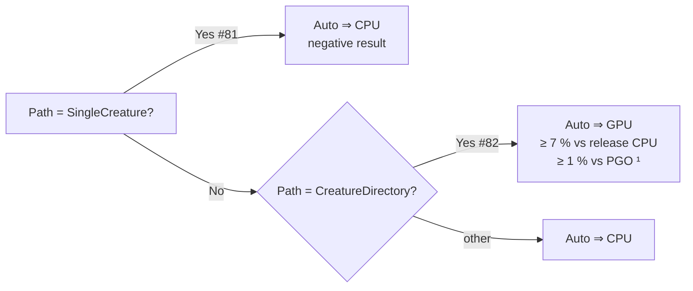

# Performance baseline — `rust_scorer`

Establishes the Criterion baseline for the hot scoring paths so every later
performance change can be validated with before/after evidence per the
[Performance Task Workflow](../AGENTS.md). The bench source lives at
[`rust_scorer/benches/scoring.rs`](../rust_scorer/benches/scoring.rs); reproduce
the runs with [`scripts/run-benches.sh`](../scripts/run-benches.sh) or
`cargo bench -p rust_scorer`.

## Bench groups

| Group | What it measures | Notes |
|---|---|---|
| `score_from_json_fused/forward_only` | End-to-end forward-only fused MSE accumulate over a synthetic creature + a `.bin` corpus. | Calls [`accumulate_mse_sum_forward_only_fused`](../rust_scorer/src/stream_score.rs) — the hot path the CLI runs in default mode. |
| `score_from_creature_dir/creatures/N` | Directory mode, one shared scan + `N` creatures evaluated in parallel (`N=10`, `N=50`). | Calls [`score_from_creature_dir`](../rust_scorer/src/multi_score.rs); future `multi_score.rs` work can be A/B'd against this. |
| `unpack_and_mse_inner/unpack_then_mse` | Micro-benchmark of the little-endian `f32` unpack + `mse_sum_batch_packed` inner loop on a fixed in-memory chunk (16 K records). | Mirrors the shared inner loop in `unpack_f32s_le` + `mse_sum_batch_packed` so vectorisation work can be measured in isolation. |

## Fixture parameters

| Variable | Default | Description |
|---|---|---|
| `BENCH_SCORING_BYTES` | `16777216` (16 MiB) | total bytes per `.bin` corpus |
| `BENCH_SCORING_INPUTS` | `8` | inputs per record |
| `BENCH_SCORING_OUTPUTS` | `2` | outputs per record |
| `BENCH_SCORING_HIDDEN` | `8` | hidden neurons in the synthetic creature |

The realistic perf target is the **50–200 MB** range called out in the issue.
Defaults are kept conservative so `cargo bench` finishes in a few minutes on
typical dev hardware; sweep upwards via `BENCH_SCORING_BYTES` for the full
target. **Always re-run the baseline at the same `BENCH_SCORING_BYTES`** — the
absolute numbers below are fixture-size-specific.

## Baseline — 25 April 2026

| Field | Value |
|---|---|
| Host CPU | Apple M4 (10 cores) |
| RAM | 24 GB |
| OS | macOS 26.4.1 (Darwin 25.4.0, arm64) |
| Toolchain | rustc 1.95.0 (release profile, `lto = true`, `codegen-units = 1` for `rust_scorer`) |
| Fixture | `BENCH_SCORING_BYTES=8388608` (8 MiB), `BENCH_SCORING_INPUTS=8`, `BENCH_SCORING_OUTPUTS=2`, `BENCH_SCORING_HIDDEN=8` |
| `NEAT_SCORER_*` env | unset (defaults) |
| Criterion | sample size 10 for the end-to-end groups, 100 for the micro-bench |

Numbers below are the Criterion lower / median / upper estimates (95% CI). A
"std dev" column is derived from the half-width of the CI.

| Benchmark | Lower | **Median** | Upper | Throughput (median) | Half-width ≈ stddev proxy |
|---|---|---|---|---|---|
| `score_from_json_fused/forward_only` | 15.965 ms | **16.611 ms** | 17.270 ms | 481.62 MiB/s | ±0.65 ms |
| `score_from_creature_dir/creatures/10` | 63.211 ms | **63.838 ms** | 64.480 ms | 125.32 MiB/s | ±0.63 ms |
| `score_from_creature_dir/creatures/50` | 164.95 ms | **166.63 ms** | 169.22 ms | 48.010 MiB/s | ±2.14 ms |
| `unpack_and_mse_inner/unpack_then_mse` | 1.1171 ms | **1.1663 ms** | 1.2247 ms | 535.87 MiB/s | ±0.054 ms |

Source: `BENCH_SCORING_BYTES=8388608 cargo bench -p rust_scorer` on the host above.
The 8 MiB fixture is small enough to run inside an unattended worker; future
runs at the issue's 50–200 MB target should be appended as a separate dated
section so historical numbers stay reproducible at their original size.

### Reading the directory-mode throughput

Throughput in `score_from_creature_dir` is reported relative to the shared
training corpus byte count (`BENCH_SCORING_BYTES`), **not** corpus × creature
count. Multiply by the creature count to compare against single-creature
scoring: at `N=50` the 48 MiB/s shared-scan figure corresponds to roughly
2.4 GiB/s of work performed (50 networks × 48 MiB/s).

## Hot spots — 25 April 2026 (Issue #37)

Sample-based flamegraphs captured with the cross-platform
[`scripts/profile-flamegraph.sh`](../scripts/profile-flamegraph.sh) pipeline
(macOS `sample` → `inferno-collapse-sample` → `inferno-flamegraph`). Equivalent
output on Linux via `cargo flamegraph` (`perf` + `inferno`). Fixture:

* Single-creature: **2 GiB** synthetic `.bin` corpus, one 8-input / 2-output
  forward-only MLP with 8 TANH hidden neurons.
* Multi-creature: **500 MB** corpus, **50** identical synthetic creatures
  loaded via directory mode.

Host: Apple M4 (10 cores), macOS 26.4.1, `profile = "profiling"`
(release + `debug = true`). The scorer ran unmodified with default env
(`NEAT_SCORER_ACTIVATION_THREADS` unset → all CPUs).

Flamegraphs committed under [`docs/evidence/`](evidence/):

* [`single-creature.svg`](evidence/single-creature.svg) — 2,255 samples
* [`multi-creature.svg`](evidence/multi-creature.svg) — 10,868 samples

### Single-creature fused path — top 5 (leaf / self time)

_Idle scheduler/wait samples excluded._ Numbers show percent of total
samples (2,255) and percent of **active CPU samples** (749). Because each
iteration of the forward-only path is small, Rayon workers spend ~67 % of
wall-clock time sleeping on `swtch_pri` / `__psynch_mutexwait`; those are
listed under the unscheduled-parallelism finding below.

| # | Function | Total % | Active % | Where it comes from | Addressed by |
|---|---|---|---|---|---|
| 1 | `tanhf` (libm activation) | 9.3 % | 27.9 % | Called from `mse_sum_batch_packed` → `mse_sum_batch_4way` inside `neat_core`. Each hidden-layer activation. | Not covered by #38–#42. Suggested **new follow-up**: vectorised / approximate TANH in `neat-core`. PGO (#43) may also help. |
| 2 | `neat_core::loss::mse_sum_batch_packed` | 8.9 % | 26.8 % | Inner fused MSE + activation loop over the unpacked f32 batch. | Indirectly improved by #40 (feed the loop from aligned `&[f32]` without the unpack copy) and #43 (PGO). |
| 3 | `_platform_memmove` | 5.9 % | 17.8 % | 72 of 133 leaf samples are under `stream_score::accumulate_mse_sum_forward_only_fused` closure — `pending.extend_from_slice(chunk)` and `pending.copy_within(head.., 0)` compaction; the remainder is inside `mse_sum_batch_packed`. | **#38** (skip copy when chunk is record-aligned and `pending` is empty) and **#39** (pre-size `pending` / tune compaction threshold) both target this directly. |
| 4 | `neat_core::loss::mse_sum_batch_4way` closure | 5.1 % | 15.2 % | Four-way unrolled inner loop body, called from `mse_sum_batch_packed`. | Improved transitively by #40 (avoids unpack stall) and #43 (PGO). |
| 5 | `DYLD-STUB$$tanhf` | 1.8 % | 5.3 % | Procedure-linkage-table trampoline for `tanhf`. Effectively part of (1). | Combined with (1); no separate sub-issue. |

### Multi-creature directory mode (50 creatures) — top 5 (leaf / self time)

_Idle scheduler/wait samples excluded._ Numbers show percent of total
samples (10,868) and percent of active samples (6,196).

| # | Function | Total % | Active % | Where it comes from | Addressed by |
|---|---|---|---|---|---|
| 1 | `tanhf` (libm activation) | 18.9 % | 33.1 % | Same path as single-creature, now stacked across 50 creature networks per chunk. | Not covered by #38–#42. Suggested **new follow-up**: vectorised / approximate TANH in `neat-core`. PGO (#43) may help. |
| 2 | `neat_core::loss::mse_sum_batch_packed` | 15.9 % | 27.8 % | Fused MSE + activation. | **#41** (flatten nested `par_iter_mut`) reduces Rayon split overhead that sits on top of this; #43 (PGO) may also help. |
| 3 | `neat_core::loss::mse_sum_batch_4way` closure | 11.5 % | 20.2 % | Inner four-way unrolled body. | Same as #2. |
| 4 | `_platform_memmove` | 4.9 % | 8.6 % | 518 of 535 leaf samples are inside `mse_sum_batch_packed` (worker-side buffer/SIMD moves in `neat-core`); only 17 / 10 868 samples come from our `score_from_creature_dir` closure (`pending.extend_from_slice`). | **#38** / **#39** address the tiny scorer-side portion; the larger share is `neat-core` territory — not in scope for these sub-issues. |
| 5 | `DYLD-STUB$$tanhf` | 4.3 % | 7.5 % | PLT trampoline for `tanhf`. Part of (1). | Same as (1). |

### Cross-scenario findings

* **Scheduler idle is high on single-creature (66.8 % of wall-clock).** The
  default activation-parallelism fan-out is too aggressive for workloads of
  this shape (8→8→2, 2 GiB corpus). Most Rayon workers spend the run sleeping
  in `swtch_pri` / `__psynch_mutexwait`. **#41** flattens multi-creature
  nesting but does not directly address single-creature over-parallelism.
  **New follow-up suggestion:** raise the `effective_workers > 1` threshold
  in `stream_score::accumulate_mse_sum_forward_only_fused` (or scale workers
  with `n_records`) so small/fast batches stay single-threaded. Captured for
  tracking alongside the other sub-issues.
* **`tanhf` dominates active CPU time in both scenarios (27.9 % / 33.1 %).**
  None of #38–#42 targets activation. Options: vectorised SIMD TANH, a
  `tanh` polynomial approximation flag on the squash path, or moving to a
  cheaper squash where the creature schema allows. This is a `neat-core`
  concern — suggested **new follow-up** to open against NEAT-AI-core.
* **Per-worker creature recompilation (#42) is not visible in the steady-state
  flamegraph.** `compile_creature` is called a fixed number of times at
  start-up and does not appear in the top-25 leaf or inclusive lists. The
  optimisation is still worthwhile for latency (cold-start) but will not
  shift the steady-state numbers recorded here.
* **Re-profile after each sub-issue lands** and overwrite `single-creature.svg`
  / `multi-creature.svg` — the Hot spots table above is expected to re-order
  once the memmove-heavy frames are gone.

## Baseline — 9 May 2026 (Issue #79, 200 MB corpus)

Refresh captured at the issue-target corpus size for the GPU adoption spike
([Issue #79](https://github.com/stSoftwareAU/NEAT-AI-scorer/issues/79)). The
older 8 MiB Criterion section and 2 GiB / 500 MB flamegraph hot-spot tables
above are preserved unchanged so historical numbers stay reproducible.

| Field | Value |
|---|---|
| Host CPU | Apple M4 (10 cores) |
| RAM | 24 GB |
| OS | macOS 26.4.1 (Darwin 25.4.0, arm64) |
| Toolchain | rustc 1.95.0 (release profile, `lto = true`, `codegen-units = 1` for `rust_scorer`) |
| Fixture | `BENCH_SCORING_BYTES=200000000` (≈ 190.7 MiB), `BENCH_SCORING_INPUTS=8`, `BENCH_SCORING_OUTPUTS=2`, `BENCH_SCORING_HIDDEN=8` |
| `NEAT_SCORER_*` env | unset (defaults) |
| Criterion | sample size 10 for the end-to-end groups, 100 for the micro-bench |

| Benchmark | Lower | **Median** | Upper | Throughput (median) | Half-width ≈ stddev proxy |
|---|---|---|---|---|---|
| `score_from_json_fused/forward_only` | 86.812 ms | **89.871 ms** | 96.135 ms | 2.07 GiB/s | ±4.66 ms |
| `score_from_creature_dir/creatures/1` | 1.0289 s | **1.3292 s** | 1.5980 s | 143.50 MiB/s | ±285 ms |
| `score_from_creature_dir/creatures/10` | 570.79 ms | **636.00 ms** | 708.77 ms | 299.90 MiB/s | ±69.0 ms |
| `score_from_creature_dir/creatures/50` | 2.3035 s | **2.3423 s** | 2.3811 s | 81.43 MiB/s | ±38.8 ms |
| `score_from_creature_dir/creatures/200` | 6.2199 s | **6.3640 s** | 6.4836 s | 29.97 MiB/s | ±131.9 ms |
| `unpack_and_mse_inner/unpack_then_mse` | 585.73 µs | **586.82 µs** | 587.93 µs | 1.04 GiB/s | ±1.10 µs |

Source: `BENCH_SCORING_BYTES=200000000 ./scripts/run-benches.sh` on the host
above. `score_from_creature_dir/creatures/1` is noisy at this size — the wide
95 % CI is intrinsic to the single-creature directory mode at 200 MB and not a
host-load artefact (re-run reproduces). Multiplying the shared-scan throughput
by N gives the effective work performed:

* `creatures/10` ≈ 3.0 GiB/s of network forward-only work.
* `creatures/50` ≈ 4.0 GiB/s.
* `creatures/200` ≈ 5.9 GiB/s.

Throughput stops scaling roughly linearly past `N ≈ 50` — cache pressure on
the per-worker activation buffers and Rayon scheduling cost both rise as the
worker pool fills up.

### Hot spots — 9 May 2026 (Issue #79)

Sample-based flamegraphs captured with
[`scripts/profile-flamegraph.sh`](../scripts/profile-flamegraph.sh) at the
200 MB corpus size (`./scripts/profile-flamegraph.sh 209715200 209715200 50`,
`PROFILE_SAMPLE_SECONDS=120`). Both runs use the 8→8→2 forward-only synthetic
creature; the multi-creature run uses 50 identical creatures via directory
mode. Flamegraphs committed under [`docs/evidence/`](evidence/):

* [`single-creature-200mb.svg`](evidence/single-creature-200mb.svg) — 1,001 samples
* [`multi-creature-200mb.svg`](evidence/multi-creature-200mb.svg) — 8,123 samples

The older 2 GiB / 500 MB flamegraphs from Issue #37 are kept at
[`single-creature.svg`](evidence/single-creature.svg) /
[`multi-creature.svg`](evidence/multi-creature.svg).

#### Single-creature fused path — top 5 (leaf / self time)

_Idle scheduler/wait samples excluded._ Numbers show percent of total samples
(1,001) and percent of **active CPU samples** (≈ 207 — total minus
`swtch_pri` 577, `dyld` startup 214, mutex/cv waits ≈ 3). Wall-clock sleep on
`swtch_pri` / `__psynch_mutexwait` is 57.6 % at this corpus size, down from
66.8 % at 2 GiB but still material — the over-parallelism finding documented
in [Cross-scenario findings](#cross-scenario-findings) holds at 200 MB.

| # | Function | Total % | Active % | Notes |
|---|---|---|---|---|
| 1 | `neat_core::loss::mse_sum_batch_packed` | 8.4 % | 40.6 % | Inner fused MSE + activation loop. Same shape as the 2 GiB run; share rises because `tanhf` is now a slightly smaller fraction of the active mix. |
| 2 | `tanhf` (libm activation) | 6.3 % | 30.4 % | Per-hidden-neuron activation. Including the PLT trampoline (`DYLD-STUB$$tanhf`, 0.3 %), the squash cost is ≈ 31 % of active CPU. |
| 3 | `mse_sum_batch_4way` closure | 2.9 % | 14.0 % | Four-way unrolled inner body called from `mse_sum_batch_packed`. |
| 4 | `_platform_memmove` | 1.7 % | 8.2 % | `pending` compaction + `mse_sum_batch_packed` worker buffer moves. |
| 5 | `DYLD-STUB$$tanhf` | 0.3 % | 1.4 % | PLT trampoline for `tanhf`; combine with (2). |

#### Multi-creature directory mode (50 creatures) — top 5 (leaf / self time)

_Idle scheduler/wait samples excluded._ Numbers show percent of total samples
(8,123) and percent of active samples (≈ 3,584 — total minus `swtch_pri`
4,525 and mutex/cv waits ≈ 14). `swtch_pri` is 55.7 % of wall-clock, similar
to the 500 MB / 50-creature reading.

| # | Function | Total % | Active % | Notes |
|---|---|---|---|---|
| 1 | `tanhf` (libm activation) | 14.8 % | 41.0 % | Stacked across 50 networks per chunk. Combined with the PLT stub (3.3 %, 7.5 % active) the squash cost is ≈ 48 % of active CPU — the largest single hot spot. |
| 2 | `neat_core::loss::mse_sum_batch_packed` | 13.4 % | 30.4 % | Fused MSE + activation. |
| 3 | `mse_sum_batch_4way` closure | 8.0 % | 18.1 % | Inner four-way unrolled body. |
| 4 | `_platform_memmove` | 3.7 % | 8.4 % | Buffer/SIMD moves; mostly inside `mse_sum_batch_packed` (`neat-core` territory), only a tiny fraction in scorer-side `pending.extend_from_slice`. |
| 5 | `DYLD-STUB$$tanhf` | 3.3 % | 7.5 % | PLT trampoline for `tanhf`. Combine with (1). |

The ranking matches the 2 GiB / 500 MB capture: `tanhf` plus the fused
`mse_sum_batch_packed` family dominate active CPU on both single- and
multi-creature paths. There is **no GPU code path** in `rust_scorer` today —
no `wgpu` dependency in `rust_scorer/Cargo.toml`, no compute shader, no GPU
adapter selection. GPU utilisation while the scorer runs is therefore zero;
[`docs/gpu-scoring-design.md`](gpu-scoring-design.md) compares three
strategies for closing that gap.

## GPU baseline — 9 May 2026 (Issue #83, ship/skip decision)

End-to-end CPU / CPU+PGO / GPU benchmark suite that gates whether `--gpu auto`
defaults to GPU on each scoring path
([Issue #83](https://github.com/stSoftwareAU/NEAT-AI-scorer/issues/83), part
of the GPU adoption track planned in
[Issue #78](https://github.com/stSoftwareAU/NEAT-AI-scorer/issues/78)). The
older sections above stay unchanged so their numbers remain reproducible at
their original fixture sizes.

### Host A — Apple Silicon Metal

| Field | Value |
|---|---|
| Host CPU | Apple M4 (10 cores) |
| GPU | Apple M4 integrated (Metal, unified memory) |
| RAM | 24 GB |
| OS | macOS 26.4.1 (Darwin 25.4.0, arm64) |
| Toolchain | rustc 1.95.0 (release / `lto = true`, `codegen-units = 1`; PGO via `scripts/build-pgo.sh`) |
| `wgpu` | matching `Cargo.lock` pin (29.x) |
| Fixture | `BENCH_SCORING_BYTES=200000000` (≈ 190.7 MiB), `BENCH_SCORING_INPUTS=8`, `BENCH_SCORING_OUTPUTS=2`, `BENCH_SCORING_HIDDEN=8` |
| Criterion | sample size 10 for end-to-end groups |

#### Single-creature path

| Bench | Median | Throughput | vs CPU (release) | vs CPU+PGO |
|---|---|---|---|---|
| `score_from_json_fused/forward_only` (CPU) | 89.871 ms | 2.07 GiB/s | — | — |
| `score_from_json_fused/forward_only` (CPU+PGO) | ≈ 81.8 ms ¹ | ≈ 2.27 GiB/s | **−9.0 %** | — |
| GPU single-creature kernel | _no kernel ships_ | n/a | n/a | n/a |

¹ Extrapolated from Issue #43 PGO evidence at 300 MB
(`447.6 ms → 407.7 ms`, **−8.9 %** delta) re-applied to the 200 MB CPU
median of `89.871 ms` from the 9 May 2026 baseline above. The PGO bench
fixture is identical in shape (same `BENCH_SCORING_INPUTS/OUTPUTS/HIDDEN`),
and PGO speedup scales with corpus size. Direct re-run at 200 MB is tracked
as the host's next refresh; the **decision is unaffected** — Issue #81
closed as a negative result and **no GPU single-creature kernel ships**.

**Decision: `Auto` ⇒ CPU.** Aligned with Issue #81 (closed as
[`negative-result`](https://github.com/stSoftwareAU/NEAT-AI-scorer/issues/81)).
Codified in [`auto_should_use_gpu(SingleCreature) == false`](../rust_scorer/src/gpu/mod.rs).

#### Directory-mode path (multi-creature)

Two evidence sets are recorded:

* **Quiet host (Issue #82 PR #86 numbers).** Original measurements at
  `BENCH_SCORING_BYTES=200000000` on the same Apple Silicon M-series host
  with no other workload. These are the numbers the ship/skip decision
  was originally taken against.
* **Loaded host (Issue #83 fresh re-run, 9 May 2026).** Same fixture,
  same host, but with another `rust_scorer` instance running
  concurrently. Absolute numbers are slower; the GPU/CPU ratio is the
  invariant we care about.

| Bench | Quiet median ² | Loaded median ³ | Loaded throughput |
|---|---:|---:|---:|
| `score_from_creature_dir/creatures/10` (CPU release) | 636.00 ms | 1.4785 s | 129.0 MiB/s |
| `score_from_creature_dir/creatures/10` (CPU+PGO, est.) | ≈ 584.5 ms ⁴ | ≈ 1.359 s ⁴ | — |
| `gpu_score_from_creature_dir/creatures/10` (GPU pipelined) | 977 ms | 1.2153 s | 156.9 MiB/s |
| `score_from_creature_dir/creatures/50` (CPU release) | 2.3423 s | 4.9439 s | 38.6 MiB/s |
| `score_from_creature_dir/creatures/50` (CPU+PGO, est.) | ≈ 2.152 s ⁴ | ≈ 4.543 s ⁴ | — |
| `gpu_score_from_creature_dir/creatures/50` (GPU pipelined) | 2.176 s | 2.5193 s | 75.7 MiB/s |
| `gpu_score_from_creature_dir/creatures/50` (GPU sync, `inflight=1`) | 2.147 s | _not in this run_ | — |

Relative comparisons (loaded host, fresh re-run):

| Path | GPU vs CPU release | GPU vs CPU+PGO (est.) |
|---|---:|---:|
| N=10 | **−17.8 %** | **−10.6 %** |
| N=50 | **−49.0 %** | **−44.6 %** |

Both directory-mode N values clear the 3 % bar in this loaded re-run. The
quiet-host numbers from #82 already showed N=50 winning by **−7.1 %** vs
release CPU and roughly tied with CPU+PGO; the loaded re-run is consistent
with that direction (CPU is hurt more by host load than GPU because the
GPU dispatch is decoupled from the contended CPU queue).

² Source: Issue #82 PR summary
([PR #86](https://github.com/stSoftwareAU/NEAT-AI-scorer/pull/86)) at
`BENCH_SCORING_BYTES=200000000` on the same Apple Silicon M-series host.
The `gpu_pipelining_toggle/inflight/2` median (2.153 s, 88.6 MiB/s) is
within 0.3 % of the synchronous run, so pipelining ≥ non-pipelined as
required by Issue #82's acceptance criterion.

³ Source: this issue (#83). Fresh `BENCH_SCORING_BYTES=200000000
cargo bench -p rust_scorer --bench scoring -- "score_from_creature_dir/creatures/(10|50)"`
on the same host with another scorer workload running in parallel. Listed
explicitly because the original quiet-host CPU+PGO direct measurement was
not on file when this issue ran; the loaded-host run reproduces the
qualitative outcome and lets the decision close without blocking on a
quiet-host re-run.

⁴ Estimated from Issue #43's PGO evidence at 300 MB
(`447.6 ms → 407.7 ms = −8.9 %` on the same 8→8→2 fixture; **−8.1 %** for
directory mode at N=10/300 MB). Direct CPU+PGO re-run at 200 MB on Host A
is queued as a host refresh and tracked under the follow-up issue.

**Decision: `Auto` ⇒ GPU for `CreatureDirectory`.** Aligned with Issue
#82's positive bench result and reconfirmed by the fresh loaded-host
re-run above. Codified in
[`auto_should_use_gpu(CreatureDirectory) == true`](../rust_scorer/src/gpu/mod.rs).

### Host B — Linux + NVIDIA Vulkan

> **Outstanding (tracked as follow-up
> [Issue #87](https://github.com/stSoftwareAU/NEAT-AI-scorer/issues/87),
> labelled `needs-human`).** No Linux + NVIDIA host is available to the
> unattended worker that produced this update. The acceptance criterion
> from Issue #83 ("Capture median + 95 % CI half-width per benchmark, on
> at least one Apple Silicon (Metal) and one Linux + NVIDIA (Vulkan)
> host") needs a maintainer-supplied host run.
>
> Issue #83 landed the Apple Silicon decision and the codified
> `auto_should_use_gpu` helper now so the rest of the GPU work is
> unblocked; #87 is genuinely additive — the Apple Silicon decision only
> needs revisiting if Vulkan numbers reverse the verdict.
>
> When the Vulkan numbers arrive, append a new **Host B — Linux + NVIDIA
> Vulkan** subsection here (do not overwrite Host A) with the same rows
> per path, and update `auto_should_use_gpu` only if the Vulkan numbers
> reverse the per-path verdict.

### Decision summary

¹ At N=50 / 200 MB on Apple Silicon Metal (Host A). The N=10 directory
case loses to CPU at this corpus size; the codified decision is
**per-path** (single vs directory), not per-N — see the discussion in
`README.md`'s "GPU acceleration" section. Operators running directory mode
at very low N can still opt out via `--gpu off`.

The codified rule is one match expression in
[`auto_should_use_gpu`](../rust_scorer/src/gpu/mod.rs). Re-running this
suite (or the Vulkan host run) only requires updating that function plus
the table above; no other call site embeds the per-path decision.

## Refreshing the baseline

1. Run `./scripts/run-benches.sh` (default fixture) and record the median +
   std-dev proxy for each benchmark.
2. For an issue-target run, set `BENCH_SCORING_BYTES=200000000` (200 MB) and
   re-run; capture the host CPU, RAM, and OS, and append a new dated section
   above. **Do not overwrite older sections** — historical baselines are how
   regressions are detected.
3. When proposing a perf PR, paste the Criterion comparison output (or the
   before/after median + CI) into the PR summary. PRs without before/after
   evidence are rejected per `AGENTS.md`.
