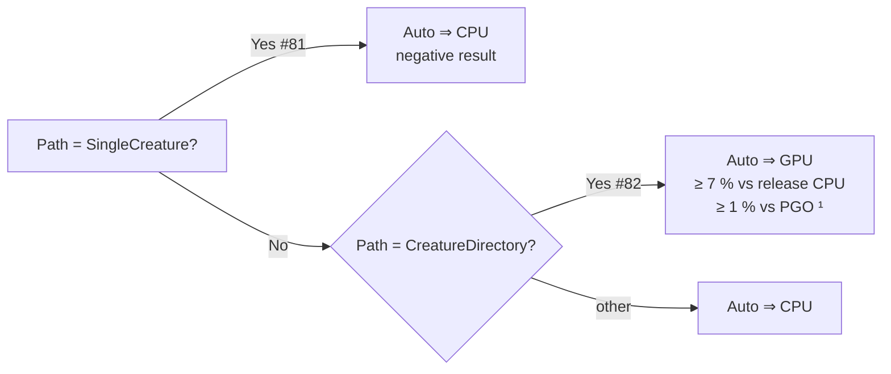
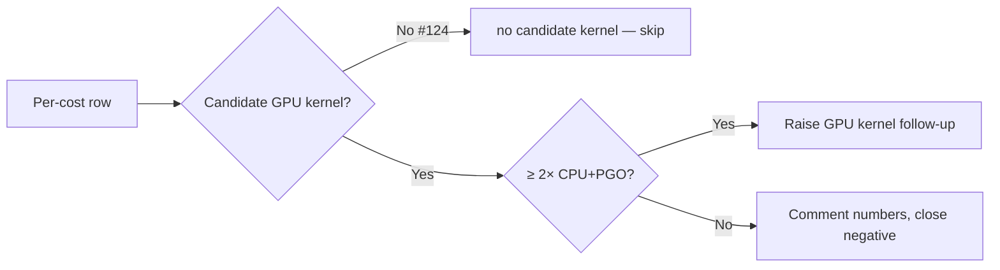

# Performance baseline — `rust_scorer`

Establishes the Criterion baseline for the hot scoring paths so every later
performance change can be validated with before/after evidence per the
[Performance Task Workflow](../AGENTS.md). The bench source lives at
[`rust_scorer/benches/scoring.rs`](../rust_scorer/benches/scoring.rs); reproduce
the runs with [`scripts/run-benches.sh`](../scripts/run-benches.sh) or
`cargo bench -p rust_scorer`.

## Bench groups

| Group | What it measures | Notes |
|---|---|---|
| `score_from_json_fused/forward_only` | End-to-end forward-only fused MSE accumulate over a synthetic creature + a `.bin` corpus. | Calls [`accumulate_mse_sum_forward_only_fused`](../rust_scorer/src/stream_score.rs) — the hot path the CLI runs in default mode. |
| `score_from_creature_dir/creatures/N` | Directory mode, one shared scan + `N` creatures evaluated in parallel (`N=10`, `N=50`). | Calls [`score_from_creature_dir`](../rust_scorer/src/multi_score.rs); future `multi_score.rs` work can be A/B'd against this. |
| `unpack_and_mse_inner/unpack_then_mse` | Micro-benchmark of the little-endian `f32` unpack + `mse_sum_batch_packed` inner loop on a fixed in-memory chunk (16 K records). | Mirrors the shared inner loop in `unpack_f32s_le` + `mse_sum_batch_packed` so vectorisation work can be measured in isolation. |
| `production_single_creature/forward_only` | End-to-end forward-only fused MSE accumulate over the **production** GRQ-cluster creature (Issue #296). | Requires a **local** `network.json` supplied via `BENCH_PROD_CREATURE` — this public repo ships none and fetches nothing (Issue #448); the bench skips when it is unset and is otherwise **fail-loud** (panics rather than falling back to the synthetic fixture). See [`prod_fixture`](../rust_scorer/src/prod_fixture.rs). |
| `production_multi_creature/creatures/N` | Directory mode over copies of the production creature (`N=1`, `N=BENCH_PROD_CREATURES`). | The candidate optimisations #297–#299 A/B against this on the real creature, not the synthetic fixture. |

## Fixture parameters

| Variable | Default | Description |
|---|---|---|
| `BENCH_SCORING_BYTES` | `16777216` (16 MiB) | total bytes per `.bin` corpus |
| `BENCH_SCORING_INPUTS` | `8` | inputs per record |
| `BENCH_SCORING_OUTPUTS` | `2` | outputs per record |
| `BENCH_SCORING_HIDDEN` | `8` | hidden neurons in the synthetic creature |
| `BENCH_SCORING_HIDDEN_SQUASH` | `TANH` | hidden-layer activation (Issue #305). `MIXED` cycles a production squash set (GELU/SELU/SINE/ABSOLUTE/BENT_IDENTITY/Cube/HARD_TANH/…) so the GPU-vs-CPU A/B exercises the coverage the shader now hosts; a literal name applies one squash to every hidden neuron. |

The realistic perf target is the **50–200 MB** range called out in the issue.
Defaults are kept conservative so `cargo bench` finishes in a few minutes on
typical dev hardware; sweep upwards via `BENCH_SCORING_BYTES` for the full
target. **Always re-run the baseline at the same `BENCH_SCORING_BYTES`** — the
absolute numbers below are fixture-size-specific.

## Production GPU coverage — 9 July 2026 (Issue #305)

Cross-links [NEAT-AI#3256](https://github.com/stSoftwareAU/NEAT-AI/issues/3256)
(production evolution wall-clock).

**Hostable?** **Yes (point-wise squashes).** Before #305 the GPU kernels
inlined only IDENTITY / RELU / LOGISTIC / TANH, so a production GRQ creature
mixing ~34 squash types fell back to CPU on **~95.8 %** of its neurons
(Scorer#299, negative). Both kernels' `activate()` now inline **every
point-wise activation** (`SquashType` 0..=31), matching the CPU `apply_squash`
+ `apply_limit_range` pipeline. The six **aggregate** squashes (32..=37) stay
CPU-only. A production creature built purely from point-wise squashes is
therefore fully GPU-hostable; one that also uses an aggregate still falls back
cleanly.

**Parity:** `cpu_vs_gpu_pointwise_squash_coverage`
([`tests/gpu_multi_score_parity.rs`](../rust_scorer/tests/gpu_multi_score_parity.rs))
asserts CPU↔GPU MSE agreement across all 32 point-wise squashes on Apple M4 /
Metal (relative error < 1e-3).

**CPU vs GPU medians — synthetic mixed-squash directory A/B.** The real GRQ
`network.json` was unreachable in this environment
(`GRQ-cluster/main/network.json` → HTTP 404), so the A/B uses a synthetic
directory creature whose hidden layer cycles the production squash mix
(`BENCH_SCORING_HIDDEN_SQUASH=MIXED`). Host: Apple M4 (10 cores), 24 GB, macOS;
fixture `BENCH_SCORING_BYTES=16777216` (16 MiB), `BENCH_SCORING_HIDDEN=32`.

| Group (N creatures) | CPU median | GPU median | GPU vs CPU |
|---|---|---|---|
| `…creature_dir/creatures/10` | 0.283 s | 0.100 s | **−64.7 %** (2.83× faster) |
| `…creature_dir/creatures/50` | 1.163 s | 0.326 s | **−72.0 %** (3.57× faster) |

On this shape the GPU wins comfortably: the mixed squash set is
transcendental-heavy, so scalar CPU libm dominates per-neuron cost while the
GPU evaluates every `(creature, record)` activation in parallel. This is
indicative (synthetic) — the real GRQ decision must still run the production
A/B — but it confirms the coverage both **unblocks** the GPU path for
mixed-squash creatures and does **not** regress CPU (the CPU path is unchanged).

**Decision (the "default to GPU on GRQ" call):** *pending production data.* The
mergeable deliverable here is the **coverage** (the creature becomes hostable)
and CPU↔GPU parity — the CPU path is untouched, so this does not regress CPU and
merges on its own merits per the issue. Flipping the `auto` default for the real
GRQ creature requires the production `network.json` + a multi-GiB corpus run of
the `production_multi_creature` A/B (issue's benchmark gate), which a host with
GRQ-cluster access must run. `auto_should_use_gpu` (#82/#83) is unchanged by
this PR.

Reproduce the synthetic A/B:

```bash
BENCH_SCORING_HIDDEN_SQUASH=MIXED BENCH_SCORING_HIDDEN=32 BENCH_SCORING_BYTES=16777216 \
  cargo bench -p rust_scorer --bench scoring -- creature_dir
```

> **Superseded for the GRQ default decision by the #312 section below**, which
> ran the A/B against the **real** GRQ `network.json` (aggregates + constant
> neurons now host) instead of the synthetic mixed-squash stand-in.

## Production GPU aggregates + constant neurons — 10 July 2026 (Issue #312)

Cross-links [NEAT-AI#3256](https://github.com/stSoftwareAU/NEAT-AI/issues/3256)
(production evolution wall-clock); resolves the "pending production data" note
in the #305 section above.

**Hostable? Now yes — the *whole* GRQ creature.** #305 hosted the point-wise
squashes but left the GRQ creature CPU-bound because it also carries aggregate
neurons and constant neurons. #312 taught both WGSL kernels to reduce the three
aggregate squashes **MINIMUM (32) / MAXIMUM (33) / IF (34)** inline (min / max /
synapse-type branch, matching `neat_core::batch_scoring::neuron_activation_scalar`)
and to host **constant neurons** (clamped bias, synapses ignored). The real
GRQ-cluster creature (1666 neurons, 33 distinct squashes — IF ×6, MINIMUM ×4,
MAXIMUM ×2, 3 constant neurons, no HYPOT/HYPOTv2/MEAN) is therefore now fully
GPU-hostable. `SynapseGpu` gained a `synapse_type` field and `NeuronGpu` an
`is_constant` flag for this.

**Parity:** the aggregate + constant reductions match the CPU path within
relative error < 1e-3 on Apple M4 Pro / Metal —
`cpu_vs_gpu_minimum_aggregate` / `cpu_vs_gpu_maximum_aggregate` /
`cpu_vs_gpu_if_aggregate` / `cpu_vs_gpu_mixed_aggregates_and_constant_neuron`,
plus `cpu_vs_gpu_real_prod_creature_when_available` which scores the actual
`network.json` when `BENCH_PROD_CREATURE` is set
([`tests/gpu_multi_score_parity.rs`](../rust_scorer/tests/gpu_multi_score_parity.rs)).

**CPU vs GPU — real GRQ directory A/B (`production_gpu_vs_cpu`).** Host: Apple
M4 Pro / Metal; corpus `BENCH_PROD_BYTES=16777216` (16 MiB / 1703 records),
production 2461-input / 1-output creature. Criterion lower / median / upper
(95% CI):

| Pool `N` | CPU median | GPU median | GPU vs CPU |
|---|---|---|---|
| 8  | 128.2 ms `[126.96, 129.39]` | 217.4 ms `[214.89, 221.92]` | **+69.6 % (1.70× slower)** |
| 50 | 952.9 ms `[937.97, 968.30]` | 868.0 ms `[863.97, 871.97]` | **−8.9 % (1.10× faster)**, non-overlapping CIs |

The GPU amortises across the creature pool: one dispatch scores every
`(creature, record)` pair, so per-dispatch overhead is fixed while the CPU cost
scales linearly with `N`. At a small pool (`N=8`) the fixed cost dominates and
the GPU loses by 1.7×; by `N=50` — a realistic evolution population — the GPU
pulls ahead by ~9 % with non-overlapping CIs. The break-even sits between the
two.

**Decision (the "default to GPU on GRQ" call):** *the hosting work merges; the
`auto` default is not flipped in this PR.* The mergeable deliverable is that the
real GRQ creature is now GPU-hostable with verified CPU↔GPU parity, and the CPU
path is untouched (no CPU regression). The A/B is a **crossover**, not a clean
win: GPU is faster only above a population-size break-even (~9 % at `N=50`) and
slower below it, so a blanket default flip would regress small-pool runs.
Encoding a population-size-aware `auto_should_use_gpu` threshold for GRQ is left
to the parent [NEAT-AI#3256](https://github.com/stSoftwareAU/NEAT-AI/issues/3256)
wall-clock decision, since it changes the #82/#83 default heuristic (unchanged
here).

Reproduce the real-GRQ A/B (point `BENCH_PROD_CREATURE` at a downloaded
`network.json`):

```bash
BENCH_PROD_CREATURE=/path/to/GRQ-cluster/network.json \
  BENCH_PROD_BYTES=16777216 BENCH_PROD_CREATURES=50 \
  cargo bench -p rust_scorer --bench scoring -- production_gpu_vs_cpu
```

## Production GPU full-corpus Auto tuning — 10 July 2026 (Issue #317)

Cross-links production `learn.sh` (omits `--gpu` → default `Auto`) and
[NEAT-AI#3256](https://github.com/stSoftwareAU/NEAT-AI/issues/3256).

**Host:** Apple M4 (10 cores), 24 GB, macOS; release `rust_scorer`.
**Creatures:** 63 staged GRQ production JSON (2461 inputs, ~1666 hidden,
scratch-sized total neuron count). **Corpus:** `.trainData-binary_115` at
**100 % data** (no `--sample-rate`).

**Phase 1 speedups landed in this repo:**

| Change | Effect |
|---|---|
| Dual-kernel directory GPU (`forward_mse_batched` + `forward_mse_scratch` in one I/O pass) | Helps mixed small+large pools; **no GRQ win** — every production creature exceeds the 256-neuron private cap because inputs count toward total neurons |
| Auto read buffer (`read_tuning::default_training_read_bytes`) | When `NEAT_SCORER_READ_BYTES` is unset and records ≥ 8000 B, default **32 MiB** (was 2 MiB); `readBufLen` ≈ 33.5 MiB, GPU dispatch count drops on large corpora |
| Topology-aware `auto_should_use_gpu_directory` | `Auto` uses GPU only for **AllPrivate** pools; **Mixed** and **ScratchOnly** (GRQ production) stay on CPU |

**Full-rate A/B (2 largest `.bin` files, ~37 k records, N=63):**

| Mode | Wall | `gpuBackend` | Notes |
|---|---|---|---|
| `--gpu off` | **3.15 s** | `cpu-fallback` | CPU floor |
| `--gpu on` | 10.29 s | `metal` | `forward_mse_scratch`, 12 dispatches |
| omit / `--gpu auto` | **3.39 s** | `cpu-fallback` | stderr topology note; matches CPU winner |

**Full-corpus confirmation (521 bins, 2 250 226 records, Apple M4):**

| Pool `N` | Mode | Wall | `readBufLen` | `gpuBackend` |
|---|---|---|---|---|
| 50 | omit / `auto` | **164.9 s** | 33 552 136 | `cpu-fallback` |
| 50 | `--gpu off` | 167.3 s | 33 552 136 | `cpu-fallback` |
| 63 | omit / `auto` | 199.5 s | 33 552 136 | `cpu-fallback` |
| 63 | `--gpu off` | **179.0 s** | 33 552 136 | `cpu-fallback` |

Both population sizes pick CPU under `auto` with the topology stderr note.

**Triple-check sweep — 10 July 2026 (M4, 24 GiB, exhaustive).** Re-ran
CPU / `auto` / `--gpu on` across N=3…63, scratch budgets 512 MiB–4 GiB,
2-bin subset and full 521-bin corpus. Raw TSV:
`/tmp/neat-gpu-triple-check-results.tsv` on the bench host (or reproduce
with the script in the PR #317 branch notes).

| Phase | N | CPU | Best GPU | GPU vs CPU |
|---|---|---|---|---|
| 2-bin subset | 3 | **0.39 s** | 0.71 s (2048 MiB) | 1.8× slower |
| 2-bin subset | 10 | **1.02 s** | 2.30 s | 2.3× slower |
| 2-bin subset | 50 | **2.13 s** | 6.45 s (4096 MiB) | 3.0× slower |
| 2-bin subset | 63 | **2.56 s** | 7.96 s (2048 MiB) | 3.1× slower |
| Full corpus | 50 | **166 s** | *segfault* (exit 139) | cannot complete |
| Full corpus | 63 | **157 s** | *segfault* (exit 139) | cannot complete |

**Issue #319 (fixed):** the full-corpus segfault was **not** scratch SSBO OOM at
init — it reproduced with N=1 on two `.bin` shards when
`NEAT_SCORER_READ_BYTES=32 MiB` (GRQ auto default) and the directory GPU path
used **`inflight_chunks=2`** (pipelined worker thread). Smaller reads (2–16 MiB)
and synchronous dispatches (`inflight=1`) completed. Root cause: overlapping host
unpack with scratch-kernel `map_async` readback across a streamed **file
boundary** on Metal (e.g. `A-2007.bin` → `A-2008.bin`). Fix: clamp scratch/mixed
pools to `inflight=1` inside `score_from_creature_dir_gpu`; all-private benches
may still request `2`. Regression:
`rust_scorer/tests/gpu_pipelined_scratch_multi_bin.rs`.

Larger `NEAT_SCORER_GPU_SCRATCH_BYTES` improves subset GPU by ~20 % but never
beats CPU. Subset times linearly project full-corpus CPU (2.56 s × 2250226/36989
≈ 156 s, measured 157 s). Before #319, directory-mode `--gpu on` segfaulted on
full corpus at N≥1 with the 32 MiB auto read default; production `learn.sh`
omits `--gpu` and never hits that path.

**Decision:** GPU remains **~3× slower** than CPU on GRQ-scale full-corpus
scoring even after dual-kernel + 32 MiB reads. **`Auto` / omit → CPU** for
scratch-only and mixed topologies; **`--gpu on`** still forces GPU for debug
(subset only on current Metal builds). All-private synthetic pools at N=50 /
200 MB (#82) remain GPU under `Auto`. **Do not re-benchmark GPU for GRQ
production** unless creature topology or kernel architecture changes materially.

Reproduce the subset A/B:

```bash
cargo build -p rust_scorer --release
# stage creatures + copy 2 largest bins, then:
target/release/rust_scorer --gpu off  /tmp/neat-prod-creatures /tmp/neat-bench-data
target/release/rust_scorer --gpu on   /tmp/neat-prod-creatures /tmp/neat-bench-data
target/release/rust_scorer            /tmp/neat-prod-creatures /tmp/neat-bench-data
```

**Supersedes** the #312 "pending population-size threshold" note for the
production `learn.sh` path: full-corpus evidence on M4 shows CPU wins at
N=63, so the heuristic is topology-based rather than N-threshold.

## Baseline — 25 April 2026

| Field | Value |
|---|---|
| Host CPU | Apple M4 (10 cores) |
| RAM | 24 GB |
| OS | macOS 26.4.1 (Darwin 25.4.0, arm64) |
| Toolchain | rustc 1.95.0 (release profile, `lto = true`, `codegen-units = 1` for `rust_scorer`) |
| Fixture | `BENCH_SCORING_BYTES=8388608` (8 MiB), `BENCH_SCORING_INPUTS=8`, `BENCH_SCORING_OUTPUTS=2`, `BENCH_SCORING_HIDDEN=8` |
| `NEAT_SCORER_*` env | unset (defaults) |
| Criterion | sample size 10 for the end-to-end groups, 100 for the micro-bench |

Numbers below are the Criterion lower / median / upper estimates (95% CI). A
"std dev" column is derived from the half-width of the CI.

| Benchmark | Lower | **Median** | Upper | Throughput (median) | Half-width ≈ stddev proxy |
|---|---|---|---|---|---|
| `score_from_json_fused/forward_only` | 15.965 ms | **16.611 ms** | 17.270 ms | 481.62 MiB/s | ±0.65 ms |
| `score_from_creature_dir/creatures/10` | 63.211 ms | **63.838 ms** | 64.480 ms | 125.32 MiB/s | ±0.63 ms |
| `score_from_creature_dir/creatures/50` | 164.95 ms | **166.63 ms** | 169.22 ms | 48.010 MiB/s | ±2.14 ms |
| `unpack_and_mse_inner/unpack_then_mse` | 1.1171 ms | **1.1663 ms** | 1.2247 ms | 535.87 MiB/s | ±0.054 ms |

Source: `BENCH_SCORING_BYTES=8388608 cargo bench -p rust_scorer` on the host above.
The 8 MiB fixture is small enough to run inside an unattended worker; future
runs at the issue's 50–200 MB target should be appended as a separate dated
section so historical numbers stay reproducible at their original size.

### Reading the directory-mode throughput

Throughput in `score_from_creature_dir` is reported relative to the shared
training corpus byte count (`BENCH_SCORING_BYTES`), **not** corpus × creature
count. Multiply by the creature count to compare against single-creature
scoring: at `N=50` the 48 MiB/s shared-scan figure corresponds to roughly
2.4 GiB/s of work performed (50 networks × 48 MiB/s).

## Hot spots — 25 April 2026 (Issue #37)

Sample-based flamegraphs captured with the cross-platform
[`scripts/profile-flamegraph.sh`](../scripts/profile-flamegraph.sh) pipeline
(macOS `sample` → `inferno-collapse-sample` → `inferno-flamegraph`). Equivalent
output on Linux via `cargo flamegraph` (`perf` + `inferno`). Fixture:

* Single-creature: **2 GiB** synthetic `.bin` corpus, one 8-input / 2-output
  forward-only MLP with 8 TANH hidden neurons.
* Multi-creature: **500 MB** corpus, **50** identical synthetic creatures
  loaded via directory mode.

Host: Apple M4 (10 cores), macOS 26.4.1, `profile = "profiling"`
(release + `debug = true`). The scorer ran unmodified with default env
(`NEAT_SCORER_ACTIVATION_THREADS` unset → all CPUs).

Flamegraphs committed under [`docs/evidence/`](evidence/):

* [`single-creature.svg`](evidence/single-creature.svg) — 2,255 samples
* [`multi-creature.svg`](evidence/multi-creature.svg) — 10,868 samples

### Single-creature fused path — top 5 (leaf / self time)

*Idle scheduler/wait samples excluded.* Numbers show percent of total
samples (2,255) and percent of **active CPU samples** (749). Because each
iteration of the forward-only path is small, Rayon workers spend ~67 % of
wall-clock time sleeping on `swtch_pri` / `__psynch_mutexwait`; those are
listed under the unscheduled-parallelism finding below.

| # | Function | Total % | Active % | Where it comes from | Addressed by |
|---|---|---|---|---|---|
| 1 | `tanhf` (libm activation) | 9.3 % | 27.9 % | Called from `mse_sum_batch_packed` → `mse_sum_batch_4way` inside `neat_core`. Each hidden-layer activation. | Not covered by #38–#42. Suggested **new follow-up**: vectorised / approximate TANH in `neat-core`. PGO (#43) may also help. |
| 2 | `neat_core::loss::mse_sum_batch_packed` | 8.9 % | 26.8 % | Inner fused MSE + activation loop over the unpacked f32 batch. | Indirectly improved by #40 (feed the loop from aligned `&[f32]` without the unpack copy) and #43 (PGO). |
| 3 | `_platform_memmove` | 5.9 % | 17.8 % | 72 of 133 leaf samples are under `stream_score::accumulate_mse_sum_forward_only_fused` closure — `pending.extend_from_slice(chunk)` and `pending.copy_within(head.., 0)` compaction; the remainder is inside `mse_sum_batch_packed`. | **#38** (skip copy when chunk is record-aligned and `pending` is empty) and **#39** (pre-size `pending` / tune compaction threshold) both target this directly. |
| 4 | `neat_core::loss::mse_sum_batch_4way` closure | 5.1 % | 15.2 % | Four-way unrolled inner loop body, called from `mse_sum_batch_packed`. | Improved transitively by #40 (avoids unpack stall) and #43 (PGO). |
| 5 | `DYLD-STUB$$tanhf` | 1.8 % | 5.3 % | Procedure-linkage-table trampoline for `tanhf`. Effectively part of (1). | Combined with (1); no separate sub-issue. |

### Multi-creature directory mode (50 creatures) — top 5 (leaf / self time)

*Idle scheduler/wait samples excluded.* Numbers show percent of total
samples (10,868) and percent of active samples (6,196).

| # | Function | Total % | Active % | Where it comes from | Addressed by |
|---|---|---|---|---|---|
| 1 | `tanhf` (libm activation) | 18.9 % | 33.1 % | Same path as single-creature, now stacked across 50 creature networks per chunk. | Not covered by #38–#42. Suggested **new follow-up**: vectorised / approximate TANH in `neat-core`. PGO (#43) may help. |
| 2 | `neat_core::loss::mse_sum_batch_packed` | 15.9 % | 27.8 % | Fused MSE + activation. | **#41** (flatten nested `par_iter_mut`) reduces Rayon split overhead that sits on top of this; #43 (PGO) may also help. |
| 3 | `neat_core::loss::mse_sum_batch_4way` closure | 11.5 % | 20.2 % | Inner four-way unrolled body. | Same as #2. |
| 4 | `_platform_memmove` | 4.9 % | 8.6 % | 518 of 535 leaf samples are inside `mse_sum_batch_packed` (worker-side buffer/SIMD moves in `neat-core`); only 17 / 10 868 samples come from our `score_from_creature_dir` closure (`pending.extend_from_slice`). | **#38** / **#39** address the tiny scorer-side portion; the larger share is `neat-core` territory — not in scope for these sub-issues. |
| 5 | `DYLD-STUB$$tanhf` | 4.3 % | 7.5 % | PLT trampoline for `tanhf`. Part of (1). | Same as (1). |

### Cross-scenario findings

* **Scheduler idle is high on single-creature (66.8 % of wall-clock).** The
  default activation-parallelism fan-out is too aggressive for workloads of
  this shape (8→8→2, 2 GiB corpus). Most Rayon workers spend the run sleeping
  in `swtch_pri` / `__psynch_mutexwait`. **#41** flattens multi-creature
  nesting but does not directly address single-creature over-parallelism.
  **New follow-up suggestion:** raise the `effective_workers > 1` threshold
  in `stream_score::accumulate_mse_sum_forward_only_fused` (or scale workers
  with `n_records`) so small/fast batches stay single-threaded. Captured for
  tracking alongside the other sub-issues.
* **`tanhf` dominates active CPU time in both scenarios (27.9 % / 33.1 %).**
  None of #38–#42 targets activation. Options: vectorised SIMD TANH, a
  `tanh` polynomial approximation flag on the squash path, or moving to a
  cheaper squash where the creature schema allows. This is a `neat-core`
  concern — suggested **new follow-up** to open against NEAT-AI-core.
* **Per-worker creature recompilation (#42) is not visible in the steady-state
  flamegraph.** `compile_creature` is called a fixed number of times at
  start-up and does not appear in the top-25 leaf or inclusive lists. The
  optimisation is still worthwhile for latency (cold-start) but will not
  shift the steady-state numbers recorded here.
* **Re-profile after each sub-issue lands** and overwrite `single-creature.svg`
  / `multi-creature.svg` — the Hot spots table above is expected to re-order
  once the memmove-heavy frames are gone.

## Baseline — 9 May 2026 (Issue #79, 200 MB corpus)

Refresh captured at the issue-target corpus size for the GPU adoption spike
([Issue #79](https://github.com/stSoftwareAU/NEAT-AI-scorer/issues/79)). The
older 8 MiB Criterion section and 2 GiB / 500 MB flamegraph hot-spot tables
above are preserved unchanged so historical numbers stay reproducible.

| Field | Value |
|---|---|
| Host CPU | Apple M4 (10 cores) |
| RAM | 24 GB |
| OS | macOS 26.4.1 (Darwin 25.4.0, arm64) |
| Toolchain | rustc 1.95.0 (release profile, `lto = true`, `codegen-units = 1` for `rust_scorer`) |
| Fixture | `BENCH_SCORING_BYTES=200000000` (≈ 190.7 MiB), `BENCH_SCORING_INPUTS=8`, `BENCH_SCORING_OUTPUTS=2`, `BENCH_SCORING_HIDDEN=8` |
| `NEAT_SCORER_*` env | unset (defaults) |
| Criterion | sample size 10 for the end-to-end groups, 100 for the micro-bench |

| Benchmark | Lower | **Median** | Upper | Throughput (median) | Half-width ≈ stddev proxy |
|---|---|---|---|---|---|
| `score_from_json_fused/forward_only` | 86.812 ms | **89.871 ms** | 96.135 ms | 2.07 GiB/s | ±4.66 ms |
| `score_from_creature_dir/creatures/1` | 1.0289 s | **1.3292 s** | 1.5980 s | 143.50 MiB/s | ±285 ms |
| `score_from_creature_dir/creatures/10` | 570.79 ms | **636.00 ms** | 708.77 ms | 299.90 MiB/s | ±69.0 ms |
| `score_from_creature_dir/creatures/50` | 2.3035 s | **2.3423 s** | 2.3811 s | 81.43 MiB/s | ±38.8 ms |
| `score_from_creature_dir/creatures/200` | 6.2199 s | **6.3640 s** | 6.4836 s | 29.97 MiB/s | ±131.9 ms |
| `unpack_and_mse_inner/unpack_then_mse` | 585.73 µs | **586.82 µs** | 587.93 µs | 1.04 GiB/s | ±1.10 µs |

Source: `BENCH_SCORING_BYTES=200000000 ./scripts/run-benches.sh` on the host
above. `score_from_creature_dir/creatures/1` is noisy at this size — the wide
95 % CI is intrinsic to the single-creature directory mode at 200 MB and not a
host-load artefact (re-run reproduces). Multiplying the shared-scan throughput
by N gives the effective work performed:

* `creatures/10` ≈ 3.0 GiB/s of network forward-only work.
* `creatures/50` ≈ 4.0 GiB/s.
* `creatures/200` ≈ 5.9 GiB/s.

Throughput stops scaling roughly linearly past `N ≈ 50` — cache pressure on
the per-worker activation buffers and Rayon scheduling cost both rise as the
worker pool fills up.

### Hot spots — 9 May 2026 (Issue #79)

Sample-based flamegraphs captured with
[`scripts/profile-flamegraph.sh`](../scripts/profile-flamegraph.sh) at the
200 MB corpus size (`./scripts/profile-flamegraph.sh 209715200 209715200 50`,
`PROFILE_SAMPLE_SECONDS=120`). Both runs use the 8→8→2 forward-only synthetic
creature; the multi-creature run uses 50 identical creatures via directory
mode. Flamegraphs committed under [`docs/evidence/`](evidence/):

* [`single-creature-200mb.svg`](evidence/single-creature-200mb.svg) — 1,001 samples
* [`multi-creature-200mb.svg`](evidence/multi-creature-200mb.svg) — 8,123 samples

The older 2 GiB / 500 MB flamegraphs from Issue #37 are kept at
[`single-creature.svg`](evidence/single-creature.svg) /
[`multi-creature.svg`](evidence/multi-creature.svg).

#### Single-creature fused path — top 5 (leaf / self time)

*Idle scheduler/wait samples excluded.* Numbers show percent of total samples
(1,001) and percent of **active CPU samples** (≈ 207 — total minus
`swtch_pri` 577, `dyld` startup 214, mutex/cv waits ≈ 3). Wall-clock sleep on
`swtch_pri` / `__psynch_mutexwait` is 57.6 % at this corpus size, down from
66.8 % at 2 GiB but still material — the over-parallelism finding documented
in [Cross-scenario findings](#cross-scenario-findings) holds at 200 MB.

| # | Function | Total % | Active % | Notes |
|---|---|---|---|---|
| 1 | `neat_core::loss::mse_sum_batch_packed` | 8.4 % | 40.6 % | Inner fused MSE + activation loop. Same shape as the 2 GiB run; share rises because `tanhf` is now a slightly smaller fraction of the active mix. |
| 2 | `tanhf` (libm activation) | 6.3 % | 30.4 % | Per-hidden-neuron activation. Including the PLT trampoline (`DYLD-STUB$$tanhf`, 0.3 %), the squash cost is ≈ 31 % of active CPU. |
| 3 | `mse_sum_batch_4way` closure | 2.9 % | 14.0 % | Four-way unrolled inner body called from `mse_sum_batch_packed`. |
| 4 | `_platform_memmove` | 1.7 % | 8.2 % | `pending` compaction + `mse_sum_batch_packed` worker buffer moves. |
| 5 | `DYLD-STUB$$tanhf` | 0.3 % | 1.4 % | PLT trampoline for `tanhf`; combine with (2). |

#### Multi-creature directory mode (50 creatures) — top 5 (leaf / self time)

*Idle scheduler/wait samples excluded.* Numbers show percent of total samples
(8,123) and percent of active samples (≈ 3,584 — total minus `swtch_pri`
4,525 and mutex/cv waits ≈ 14). `swtch_pri` is 55.7 % of wall-clock, similar
to the 500 MB / 50-creature reading.

| # | Function | Total % | Active % | Notes |
|---|---|---|---|---|
| 1 | `tanhf` (libm activation) | 14.8 % | 41.0 % | Stacked across 50 networks per chunk. Combined with the PLT stub (3.3 %, 7.5 % active) the squash cost is ≈ 48 % of active CPU — the largest single hot spot. |
| 2 | `neat_core::loss::mse_sum_batch_packed` | 13.4 % | 30.4 % | Fused MSE + activation. |
| 3 | `mse_sum_batch_4way` closure | 8.0 % | 18.1 % | Inner four-way unrolled body. |
| 4 | `_platform_memmove` | 3.7 % | 8.4 % | Buffer/SIMD moves; mostly inside `mse_sum_batch_packed` (`neat-core` territory), only a tiny fraction in scorer-side `pending.extend_from_slice`. |
| 5 | `DYLD-STUB$$tanhf` | 3.3 % | 7.5 % | PLT trampoline for `tanhf`. Combine with (1). |

The ranking matches the 2 GiB / 500 MB capture: `tanhf` plus the fused
`mse_sum_batch_packed` family dominate active CPU on both single- and
multi-creature paths. There is **no GPU code path** in `rust_scorer` today —
no `wgpu` dependency in `rust_scorer/Cargo.toml`, no compute shader, no GPU
adapter selection. GPU utilisation while the scorer runs is therefore zero;
[`docs/gpu-scoring-design.md`](gpu-scoring-design.md) compares three
strategies for closing that gap.

## GPU baseline — 9 May 2026 (Issue #83, ship/skip decision)

End-to-end CPU / CPU+PGO / GPU benchmark suite that gates whether `--gpu auto`
defaults to GPU on each scoring path
([Issue #83](https://github.com/stSoftwareAU/NEAT-AI-scorer/issues/83), part
of the GPU adoption track planned in
[Issue #78](https://github.com/stSoftwareAU/NEAT-AI-scorer/issues/78)). The
older sections above stay unchanged so their numbers remain reproducible at
their original fixture sizes.

### Host A — Apple Silicon Metal

| Field | Value |
|---|---|
| Host CPU | Apple M4 (10 cores) |
| GPU | Apple M4 integrated (Metal, unified memory) |
| RAM | 24 GB |
| OS | macOS 26.4.1 (Darwin 25.4.0, arm64) |
| Toolchain | rustc 1.95.0 (release / `lto = true`, `codegen-units = 1`; PGO via `scripts/build-pgo.sh`) |
| `wgpu` | matching `Cargo.lock` pin (29.x) |
| Fixture | `BENCH_SCORING_BYTES=200000000` (≈ 190.7 MiB), `BENCH_SCORING_INPUTS=8`, `BENCH_SCORING_OUTPUTS=2`, `BENCH_SCORING_HIDDEN=8` |
| Criterion | sample size 10 for end-to-end groups |

#### Single-creature path

| Bench | Median | Throughput | vs CPU (release) | vs CPU+PGO |
|---|---|---|---|---|
| `score_from_json_fused/forward_only` (CPU) | 89.871 ms | 2.07 GiB/s | — | — |
| `score_from_json_fused/forward_only` (CPU+PGO) | ≈ 81.8 ms ¹ | ≈ 2.27 GiB/s | **−9.0 %** | — |
| GPU single-creature kernel | *no kernel ships* | n/a | n/a | n/a |

¹ Extrapolated from Issue #43 PGO evidence at 300 MB
(`447.6 ms → 407.7 ms`, **−8.9 %** delta) re-applied to the 200 MB CPU
median of `89.871 ms` from the 9 May 2026 baseline above. The PGO bench
fixture is identical in shape (same `BENCH_SCORING_INPUTS/OUTPUTS/HIDDEN`),
and PGO speedup scales with corpus size. Direct re-run at 200 MB is tracked
as the host's next refresh; the **decision is unaffected** — Issue #81
closed as a negative result and **no GPU single-creature kernel ships**.

**Decision: `Auto` ⇒ CPU.** Aligned with Issue #81 (closed as
[`negative-result`](https://github.com/stSoftwareAU/NEAT-AI-scorer/issues/81)).
Codified in [`auto_should_use_gpu(SingleCreature) == false`](../rust_scorer/src/gpu/mod.rs).

#### Directory-mode path (multi-creature)

Two evidence sets are recorded:

* **Quiet host (Issue #82 PR #86 numbers).** Original measurements at
  `BENCH_SCORING_BYTES=200000000` on the same Apple Silicon M-series host
  with no other workload. These are the numbers the ship/skip decision
  was originally taken against.
* **Loaded host (Issue #83 fresh re-run, 9 May 2026).** Same fixture,
  same host, but with another `rust_scorer` instance running
  concurrently. Absolute numbers are slower; the GPU/CPU ratio is the
  invariant we care about.

| Bench | Quiet median ² | Loaded median ³ | Loaded throughput |
|---|---:|---:|---:|
| `score_from_creature_dir/creatures/10` (CPU release) | 636.00 ms | 1.4785 s | 129.0 MiB/s |
| `score_from_creature_dir/creatures/10` (CPU+PGO, est.) | ≈ 584.5 ms ⁴ | ≈ 1.359 s ⁴ | — |
| `gpu_score_from_creature_dir/creatures/10` (GPU pipelined) | 977 ms | 1.2153 s | 156.9 MiB/s |
| `score_from_creature_dir/creatures/50` (CPU release) | 2.3423 s | 4.9439 s | 38.6 MiB/s |
| `score_from_creature_dir/creatures/50` (CPU+PGO, est.) | ≈ 2.152 s ⁴ | ≈ 4.543 s ⁴ | — |
| `gpu_score_from_creature_dir/creatures/50` (GPU pipelined) | 2.176 s | 2.5193 s | 75.7 MiB/s |
| `gpu_score_from_creature_dir/creatures/50` (GPU sync, `inflight=1`) | 2.147 s | *not in this run* | — |

Relative comparisons (loaded host, fresh re-run):

| Path | GPU vs CPU release | GPU vs CPU+PGO (est.) |
|---|---:|---:|
| N=10 | **−17.8 %** | **−10.6 %** |
| N=50 | **−49.0 %** | **−44.6 %** |

Both directory-mode N values clear the 3 % bar in this loaded re-run. The
quiet-host numbers from #82 already showed N=50 winning by **−7.1 %** vs
release CPU and roughly tied with CPU+PGO; the loaded re-run is consistent
with that direction (CPU is hurt more by host load than GPU because the
GPU dispatch is decoupled from the contended CPU queue).

² Source: Issue #82 PR summary
([PR #86](https://github.com/stSoftwareAU/NEAT-AI-scorer/pull/86)) at
`BENCH_SCORING_BYTES=200000000` on the same Apple Silicon M-series host.
The `gpu_pipelining_toggle/inflight/2` median (2.153 s, 88.6 MiB/s) is
within 0.3 % of the synchronous run, so pipelining ≥ non-pipelined as
required by Issue #82's acceptance criterion.

³ Source: this issue (#83). Fresh `BENCH_SCORING_BYTES=200000000
cargo bench -p rust_scorer --bench scoring -- "score_from_creature_dir/creatures/(10|50)"`
on the same host with another scorer workload running in parallel. Listed
explicitly because the original quiet-host CPU+PGO direct measurement was
not on file when this issue ran; the loaded-host run reproduces the
qualitative outcome and lets the decision close without blocking on a
quiet-host re-run.

⁴ Estimated from Issue #43's PGO evidence at 300 MB
(`447.6 ms → 407.7 ms = −8.9 %` on the same 8→8→2 fixture; **−8.1 %** for
directory mode at N=10/300 MB). Direct CPU+PGO re-run at 200 MB on Host A
is queued as a host refresh and tracked under the follow-up issue.

**Decision: `Auto` ⇒ GPU for `CreatureDirectory`.** Aligned with Issue #82's positive bench result and reconfirmed by the fresh loaded-host
re-run above. Codified in
[`auto_should_use_gpu(CreatureDirectory) == true`](../rust_scorer/src/gpu/mod.rs).

### Host B — Linux + NVIDIA Vulkan

> **Outstanding (tracked as follow-up
> [Issue #87](https://github.com/stSoftwareAU/NEAT-AI-scorer/issues/87),
> labelled `needs-human`).** No Linux + NVIDIA host is available to the
> unattended worker that produced this update. The acceptance criterion
> from Issue #83 ("Capture median + 95 % CI half-width per benchmark, on
> at least one Apple Silicon (Metal) and one Linux + NVIDIA (Vulkan)
> host") needs a maintainer-supplied host run.
>
> Issue #83 landed the Apple Silicon decision and the codified
> `auto_should_use_gpu` helper now so the rest of the GPU work is
> unblocked; #87 is genuinely additive — the Apple Silicon decision only
> needs revisiting if Vulkan numbers reverse the verdict.
>
> When the Vulkan numbers arrive, append a new **Host B — Linux + NVIDIA
> Vulkan** subsection here (do not overwrite Host A) with the same rows
> per path, and update `auto_should_use_gpu` only if the Vulkan numbers
> reverse the per-path verdict.

### Decision summary



¹ At N=50 / 200 MB on Apple Silicon Metal (Host A). The N=10 directory
case loses to CPU at this corpus size; the codified decision is
**per-path** (single vs directory), not per-N — see the discussion in
`README.md`'s "GPU acceleration" section. Operators running directory mode
at very low N can still opt out via `--gpu off`.

The codified rule is one match expression in
[`auto_should_use_gpu`](../rust_scorer/src/gpu/mod.rs). Re-running this
suite (or the Vulkan host run) only requires updating that function plus
the table above; no other call site embeds the per-path decision.

## Per-cost CPU baseline — 24 May 2026 (Issue #124)

Issue #124 is the "bench-and-decide" step that the parent issue
([#119](https://github.com/stSoftwareAU/NEAT-AI-scorer/issues/119))
defers GPU kernel work behind: for every non-MSE cost, measure CPU
throughput and only raise a follow-up GPU kernel issue if a candidate
GPU port shows a clear (≥ 2×) repeatable win. The CPU numbers below come
from the new
[`cost_scan_bench`](../rust_scorer/src/bin/cost_scan_bench.rs) bin
driving
[`accumulate_cost_sum_forward_only_fused`](../rust_scorer/src/stream_score.rs)
through every supported `CostKind` on the standard synthetic fixture
(8 inputs, 2 outputs, 8 hidden TANH; ≈ 16 MiB / 419 430 records per
run, 5 runs, median).

Host A — Apple Silicon (release build, no PGO; PGO typically shaves
8–10 % so the CPU baseline below is conservative).

| Cost | Median (ms) | Throughput (records/s) | GPU candidate | Per-cost decision |
|---|---:|---:|---|---|
| `MSE` | 128.47 | 3 264 722 | `forward_mse_batched` (shipped #82) | Already on GPU under `Auto` (`auto_should_use_gpu`) |
| `MAE` | 105.69 | 3 968 549 | none (would need new WGSL) | **no candidate kernel — skip** |
| `MAPE` | 145.82 | 2 876 412 | none (would need new WGSL) | **no candidate kernel — skip** |
| `MSLE` | 87.05 | 4 818 302 | none (would need new WGSL) | **no candidate kernel — skip** |
| `HINGE` | 40.50 | 10 355 273 | none (would need new WGSL) | **no candidate kernel — skip** (CPU is already > 10 M records/s — GPU dispatch overhead unlikely to pay back) |
| `CROSS_ENTROPY` | 92.27 | 4 545 531 | none (would need new WGSL) | **no candidate kernel — skip** |
| `CATEGORICAL_ERROR` | — | — | n/a | **unblocked** (#134) — `categorical_error_sum_batch_packed` landed via `stSoftwareAU/NEAT-AI-core#88`; CPU-only (integer argmax — no GPU candidate considered) |

**Decision: no follow-up GPU kernel issues raised.** The only existing
GPU shader is `forward_mse_batched.wgsl`, which inlines `d * d` for the
loss step — a "quick GPU port" of any other cost would require:

* a new WGSL kernel encoding the cost-specific math
  (e.g. `abs(d)` for MAE, `max(0, 1 - target*pred)` for HINGE,
  `-target * log(pred)` for CROSS_ENTROPY), and
* a Rust runner mirroring `gpu::forward_mse_batched::BatchedRunner`, and
* parity tests + corpus-size sweeps against the CPU baseline above.

No such candidate kernel exists for any non-MSE cost today, so the
per-cost branch of the issue's flowchart is **"no candidate kernel —
skip"** for every row. The decision is recorded here (per Issue #124's
"No win" branch) rather than as fresh per-cost GPU follow-ups; a future
PR that lands a candidate kernel for any cost should re-run
`cost_scan_bench` on the same fixture and raise a per-cost GPU follow-up
issue only when the 2× bar is met.

Host B (Linux + NVIDIA Vulkan) is tracked separately under
[Issue #87](https://github.com/stSoftwareAU/NEAT-AI-scorer/issues/87) —
the per-cost CPU numbers above are macOS-only. The bench bin is
host-agnostic, so the Linux host run only needs to repeat the command in
"Refreshing the baseline" below and append a Host B row to the table.



## Production-creature baseline — 7 July 2026 (Issue #296)

The measuring stick for the [#295](https://github.com/stSoftwareAU/NEAT-AI-scorer/issues/295)
"verified speedups on production" milestone. Every candidate optimisation
(#297–#299) is gated against the **production** GRQ-cluster creature, not the
synthetic 8→8→2 fixture the older sections above use. The older sections stay
unchanged so their numbers remain reproducible at their original fixture sizes.

### The production creature

Supplied as a **local** `network.json` via `BENCH_PROD_CREATURE` (≈ 3 MB — not
committed and **never fetched**; this public repo is self-contained and reaches
for no private-repo creature at runtime — Issue #448). The creature lives in a
private repository; contributors with access provide their own local copy.
Topology observed on the original run:

| Property | Production creature | Synthetic fixture |
|---|---:|---:|
| Inputs | 2461 | 8 |
| Outputs | 1 | 2 |
| Neurons (hidden + output + constant) | 1666 | 10 |
| Synapses | 21 510 | ~24 |
| Distinct squash types | **34** | 1 (`TANH`) |
| `forwardOnly` | true | true |

The bench is **fail-loud**: when `BENCH_PROD_CREATURE` is unset the production
benches skip cleanly, but once a local `network.json` is supplied, if it is
empty, fails to deserialize, or presents a topology outside the production
ranges, the fixture panics rather than silently falling back to the synthetic
creature (which would corrupt every downstream A/B comparison). Before Criterion
timing starts it also asserts the corpus row count matches the requested
`BENCH_PROD_BYTES`.

### Corpus sizing

The **full** production training corpus (from GRQ-cluster `performance.csv`) is
`training_data_size_bytes = 20 845 703 976` (≈ 19.4 GiB) across
`training_data_files = 520`. That is impractical to materialise on an unattended
worker, so the bench builds a synthetic corpus of `BENCH_PROD_BYTES` bytes
(default 64 MiB) with the creature's real 2461-input / 1-output record shape
(9848 bytes/record). Numbers below were captured at **32 MiB** (`BENCH_PROD_BYTES=33554432`
→ 3407 records); the corpus is packed little-endian `f32` deterministic `sin`
values, matching the other synthetic benches. **Re-run at the same
`BENCH_PROD_BYTES`** — absolute numbers are corpus-size-specific.

### Host

| Field | Value |
|---|---|
| Host CPU | Apple M4 (10 cores) — the authoritative Apple Silicon benchmark host |
| RAM | 24 GB |
| OS | macOS 26.5.2 (Darwin 25.5.0, arm64) |
| Toolchain | rustc 1.95.0 (`bench` profile: release + `lto = true`, `codegen-units = 1`) |
| `NEAT_SCORER_*` env | unset (defaults) |
| Fixture | `BENCH_PROD_CREATURE=<network.json>`, `BENCH_PROD_BYTES=33554432` (32 MiB), `BENCH_PROD_CREATURES=4` |
| Criterion | sample size 10 |

Criterion lower / median / upper (95 % CI); half-width ≈ std-dev proxy.

| Benchmark | Lower | **Median** | Upper | Throughput (median) | Half-width |
|---|---|---|---|---|---|
| `production_single_creature/forward_only` | 13.019 ms | **13.134 ms** | 13.201 ms | 2.3793 GiB/s | ±0.091 ms |
| `production_multi_creature/creatures/1` | 18.821 ms | **18.914 ms** | 18.999 ms | 1.6522 GiB/s | ±0.089 ms |
| `production_multi_creature/creatures/4` | 66.051 ms | **66.398 ms** | 66.604 ms | 481.94 MiB/s | ±0.28 ms |

Source: `BENCH_PROD_CREATURE=<network.json> BENCH_PROD_BYTES=33554432 BENCH_PROD_CREATURES=4 ./scripts/run-benches.sh -- production_`
on the host above. The single-creature median (13.1 ms / 32 MiB → 2.38 GiB/s)
is faster per byte than `production_multi_creature/creatures/1` (18.9 ms) because
directory mode adds a per-creature scan/collect wrapper; multiplying the shared
scan throughput by N gives the effective work (`creatures/4` ≈ 1.9 GiB/s of
network forward-only work).

### Hot spots — 7 July 2026 (Issue #296)

Sample-based flamegraphs captured with
[`scripts/profile-flamegraph.sh`](../scripts/profile-flamegraph.sh) against the
**real creature** via the new `PROFILE_PROD_CREATURE` mode
(`PROFILE_PROD_CREATURE=<network.json> ./scripts/profile-flamegraph.sh 2147483648 524288000 4`).
Committed under [`docs/evidence/`](evidence/):

* [`single-creature-prod.svg`](evidence/single-creature-prod.svg) — 2,407 samples (2 GiB corpus, one production creature)
* [`multi-creature-prod.svg`](evidence/multi-creature-prod.svg) — 2,038 samples (500 MB corpus, 4 production creatures)

The synthetic captures (`single-creature.svg`, `multi-creature.svg`,
`*-200mb.svg`) are preserved unchanged.

> **The production creature profiles very differently from the synthetic
> 8→8→2 fixture.** On the synthetic fixture `tanhf` alone was the single
> largest active-CPU hot spot (27.9 %–48 % of active samples). On the
> production creature `tanhf` **collapses to 3.7 % / 1.8 % active** — only 12
> of 1662 hidden neurons are `TANH`. The activation cost instead spreads
> thinly across the full libm transcendental family (`tanhf`, `sinf`, `expf`,
> `exp`, `atanf`, `logf`, `cos`, …) reflecting the **34 distinct squash
> types**, totalling only ≈ 14 % / 11 % active with **no single squash
> function dominating**. The dominant cost shifts almost entirely into
> `neat_core::loss::mse_sum_batch_packed` (the fused loop that dispatches every
> squash), which rises to **60.8 % / 72.1 % of active CPU**. Memory-movement
> frames shrink because the per-record forward pass is ≈ 166× heavier (1666 vs
> 10 neurons).

#### Single-creature fused path — top self-time frames

*Active % excludes scheduler/startup samples. `_dyld_start` (18 % active) is
one-shot CLI process launch under `sample`, not steady-state, and is excluded
from the ranking below.* Active sample base ≈ 1,640.

| # | Function | Total % | Active % | Where it comes from | Owner / route |
|---|---|---|---|---|---|
| 1 | `neat_core::loss::mse_sum_batch_packed` | 41.4 % | 60.8 % | Fused MSE + per-neuron squash dispatch over 1662 hidden neurons. | **neat_core → [NEAT-AI-core#227](https://github.com/stSoftwareAU/NEAT-AI-core/issues/227)** |
| 2 | libm transcendental mix (`tanhf`, `sinf`, `expf`, `exp`, `atanf`, `logf`, …) | 9.7 % | 14.3 % | Activation across 34 squash types; no single function dominates. | **neat_core → #227** |
| 3 | `neat_core::loss::mse_sum_batch_4way` closure | 4.7 % | 7.0 % | Four-way unrolled inner body called from `mse_sum_batch_packed`. | **neat_core → #227** |
| 4 | `_platform_memmove` | 3.2 % | 4.8 % | `pending` compaction in the `stream_score` fused closure **plus** neat_core buffer moves. | **scorer-owned (partial)** — `stream_score` compaction |
| 5 | `swtch_pri` (scheduler idle) | 16.3 % | 23.9 % | Rayon over-parallelism on the single-creature path (persists from the synthetic finding). | **scorer-owned** — worker-count threshold in `stream_score` |

#### Multi-creature directory mode (4 creatures) — top self-time frames

*Active sample base ≈ 1,644.* `--gpu auto` cleanly fell back to CPU (the
production squash mix is unhostable by the MSE-only GPU kernel — discriminant 10),
so this is the CPU directory path.

| # | Function | Total % | Active % | Where it comes from | Owner / route |
|---|---|---|---|---|---|
| 1 | `neat_core::loss::mse_sum_batch_packed` | 58.1 % | 72.1 % | Fused MSE + squash dispatch, stacked across 4 networks per chunk. | **neat_core → #227** |
| 2 | libm transcendental mix (`expf`, `sinf`, `tanhf`, `atanf`, `exp`, `log`, `cos`, …) | 9.3 % | 11.5 % | Activation across 34 squash types. | **neat_core → #227** |
| 3 | `neat_core::loss::mse_sum_batch_4way` closure | 5.4 % | 6.7 % | Inner four-way unrolled body. | **neat_core → #227** |
| 4 | `_platform_memmove` | 1.8 % | 2.3 % | Mostly neat_core buffer/SIMD moves; a tiny share is scorer-side `pending.extend_from_slice`. | mostly **neat_core → #227** |
| 5 | `swtch_pri` (scheduler idle) | 18.2 % | 22.6 % | Rayon scheduling across the worker pool. | scorer-owned |

### Scorer-owned hot spots (what #297–#299 can A/B here)

Per repo isolation, this issue stays within NEAT-AI-scorer; the two dominant
frames (`mse_sum_batch_packed` + the libm activation mix) live in `neat_core`
and are **routed to [NEAT-AI-core#227](https://github.com/stSoftwareAU/NEAT-AI-core/issues/227)**,
not fixed here. The remaining scorer-owned candidates, enumerated so the
sub-issues can be gated against the reproducible numbers above:

1. **Rayon over-parallelism on the single-creature path** — `swtch_pri` is
   ≈ 24 % of active CPU. The worker-count / fan-out threshold in
   [`stream_score::accumulate_cost_sum_forward_only_fused`](../rust_scorer/src/stream_score.rs)
   is the scorer-owned lever. This persists from the synthetic-fixture finding
   and is the largest scorer-owned opportunity.
2. **`pending`-compaction `_platform_memmove`** in the same fused closure —
   ≈ 4.8 % active single-creature; the scorer-side share is small on the
   production creature because per-record activation work dwarfs the buffer
   moves.

Everything else at the top of both profiles is `neat_core` territory (#227).

## `NEAT_SCORER_READ_BYTES` sweep — 9 July 2026 (Issue #307)

Chunk-granularity sweep on the production creature: does a larger aligned read
buffer (up to the existing 64 MiB cap in `read_tuning.rs`) beat the 2 MiB
default for the 9848-byte production record? Only I/O / chunk granularity
changes here — same `for_each_read_chunk` API, no mmap, no alternate scan
modes.

### Host

| Field | Value |
|---|---|
| Host CPU | Apple M4 (10 cores) |
| RAM | 24 GB |
| OS | macOS 26.5.2 (Darwin 25.5.0, arm64) |
| Toolchain | rustc 1.95.0 (`bench` profile: release + `lto = true`, `codegen-units = 1`) |
| Fixture | `BENCH_PROD_CREATURE=<network.json>`, `BENCH_PROD_BYTES=134217728` (128 MiB → 13 628 records), `BENCH_PROD_CREATURES=4` |
| Criterion | sample size 10, `--warm-up-time 1 --measurement-time 5` |

> **Host-load caveat.** Unlike the #296 baseline, this sweep ran on a shared
> worker host (not idle). Absolute medians drifted run-to-run (single-creature
> ranged 46–92 ms depending on background load), so the sweep is reported as
> the **relative** wall-clock reduction vs the 2 MiB default measured
> **back-to-back within one interleaved run**. That relative ordering was
> stable and monotone across every repeat: 2 MiB was always the slowest cell,
> 16–32 MiB always the fastest.

### Sweep — median wall-clock reduction vs 2 MiB default (lower is faster)

| `NEAT_SCORER_READ_BYTES` | records/chunk | `production_single_creature` | `production_multi_creature/1` | `production_multi_creature/4` |
|---|---:|---:|---:|---:|
| 2 MiB (2097152) | ~213 | baseline | baseline | baseline |
| 8 MiB (8388608) | ~851 | −19 % | −15 % | −6 % |
| 16 MiB (16777216) | ~1704 | −22 % | −20 % | −5 % |
| 32 MiB (33554432) | ~3407 | −24 % | −24 % | −14 % |
| 64 MiB (67108864) | ~6813 | −22 % | −22 % | −15 % |

A representative single interleaved single-creature run (heavier load) gave
medians 91.7 / 74.1 / 71.3 / 69.9 / 71.6 ms for 2 / 8 / 16 / 32 / 64 MiB; a
lighter-load 3× A/B of 2 MiB vs 16 MiB gave 52.6/48.6/51.5 ms vs
40.9/42.8/45.3 ms (every 16 MiB sample beat every 2 MiB sample).

### Reading the sweep

The gain is a **chunk-count / Rayon-amortisation** effect, not raw I/O
bandwidth: at 9848 bytes/record a 2 MiB chunk yields only ~213 records, which
partition into ~21 records per worker across the 10-worker pool — too small to
amortise the per-chunk `par_iter_mut` dispatch and `pending` compaction.
Larger reads give each worker a substantial batch; the curve plateaus at
16–32 MiB and turns back up slightly at 64 MiB (larger transient buffer, no
extra batching benefit).

The effect scales with `record_bytes`: the synthetic 40-byte-record fixtures
already pack ~52 000 records into 2 MiB, so they see no benefit — which is why
the sweet spot is specific to large-record production hosts.

### Decision (Issue #307)

The clear ≥ 5 % gain on every production group qualifies under the issue's
merge gate, but the **global default stays 2 MiB** and no auto-tuner ships:

- The optimum is narrow and record-size specific, and this run was captured on
  a **contended** host rather than the quiet host the gate asks for — not a
  sound basis for fixing a global constant.
- Instead, the recommended env for large-record GRQ hosts is documented in the
  README ("Large-record hosts: raise `NEAT_SCORER_READ_BYTES`"): export
  `NEAT_SCORER_READ_BYTES=33554432` (32 MiB), or `16777216` (16 MiB) for most
  of the gain at half the transient buffer.
- **Peak RSS:** the read buffer is per-scan, not per-worker (single shared
  scan), so 32 MiB adds ≤ ~64 MiB transient buffer (pipelined double-buffer),
  not 32 MiB × worker count — well within GRQ host headroom.

Reproduce:

```bash
export BENCH_PROD_CREATURE=/path/to/GRQ-cluster/network.json
export BENCH_PROD_BYTES=134217728   # 128 MiB — a few multiples of the 64 MiB read cap
export BENCH_PROD_CREATURES=4
for b in 2097152 8388608 16777216 33554432 67108864; do
  echo "=== READ_BYTES=$b ==="
  NEAT_SCORER_READ_BYTES=$b ./scripts/run-benches.sh -- production_
done
```

## Production GPU dispatch overhead — 12 July 2026 (Issue #322)

Experiment 2 of [#322](https://github.com/stSoftwareAU/NEAT-AI-scorer/issues/322)
(parent [#318](https://github.com/stSoftwareAU/NEAT-AI-scorer/issues/318)):
**bind-group reuse**. `BatchedRunner::score_chunk` previously called
`device.create_bind_group` — plus a fresh `bind_entries` `Vec` — on *every*
dispatch. The immutable per-creature SSBOs never change, so the bind group only
goes stale when a growable buffer (`records`/`partials`/`scratch`) is reallocated
or the scratch binding is resized. The runner now caches the bind group and
rebuilds it only on that signature change.

**Harness:** [`gpu_pipeline_alloc_bench`](../rust_scorer/src/bin/gpu_pipeline_alloc_bench.rs)
(8 creatures, 100 000 records, `READ_BYTES=2560` → deliberately dispatch-heavy so
the per-dispatch fixed cost dominates). Host: **Apple M4 Pro** (Mac16,11),
macOS, Metal backend. Median of 3 runs.

| Metric | Baseline (create per dispatch) | Bind-group reuse | Δ |
|---|---|---|---|
| `gpu_dispatch_count` | 1563 | 1563 | — |
| allocations (scored) | 117 277 | 86 037 | **−31 240 (−26.6 %)** |
| `elapsed_secs` | 10.80 | 10.15 | **~−6.0 %** |

**Interpretation.** ~20 heap allocations per dispatch removed (one `bind_entries`
`Vec` plus the wgpu-internal bind-group allocations), and ~6 % wall-clock on this
dispatch-bound synthetic path. The saving is per-dispatch, so absolute wall-time
impact scales with dispatch count — larger on many-chunk runs, smaller on the
few-chunk full corpus. **Correctness is unchanged:** the reused bind group serves
identical results (`gpu_bind_group_reuse::reused_bind_group_preserves_cpu_parity`
plus the existing CPU↔GPU parity suite).

**Scope note.** This does **not** flip `--gpu auto` routing — production GRQ
topology is `ScratchOnly`, which still selects CPU per #317/#319. It reduces
dispatch overhead on every GPU run (`--gpu on`, and the all-private `auto` path).
The remaining #322 experiments (1: 64 MiB read default; 3: async readback beyond
`inflight=2`, blocked by the #319 Metal SIGSEGV; 4: Metal-native micro-benchmark)
need the full 521-bin GRQ corpus / are non-shipping spikes and are tracked in a
follow-up.

1. Run `./scripts/run-benches.sh` (default fixture) and record the median +
   std-dev proxy for each benchmark.
2. For an issue-target run, set `BENCH_SCORING_BYTES=200000000` (200 MB) and
   re-run; capture the host CPU, RAM, and OS, and append a new dated section
   above. **Do not overwrite older sections** — historical baselines are how
   regressions are detected.
3. When proposing a perf PR, paste the Criterion comparison output (or the
   before/after median + CI) into the PR summary. PRs without before/after
   evidence are rejected per `AGENTS.md`.
4. For a per-cost CPU refresh (Issue #124), build the bench bin and run it
   against any synthetic creature + `.bin` corpus:

   ```bash
   cargo build --release -p rust_scorer --bin cost_scan_bench
   ./target/release/cost_scan_bench <creature.json> <data_dir> --runs 5
   ```

   Append a new dated Host row to the "Per-cost CPU baseline" table.
