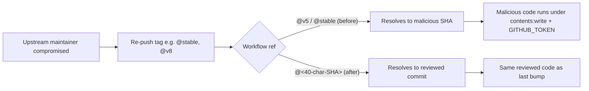

# Pin every GitHub Actions `uses:` to a 40-char SHA (Issue #100)

## Summary

Every `uses:` reference across `.github/workflows/*.yml` is now pinned to
a 40-character commit SHA with the human-readable version recorded in a
trailing `# <label>` comment, mirroring the policy already applied in
`markdown-lint.yml`. This closes the supply-chain hole called out in
Issue #100: a compromised maintainer or re-tagged ref could previously
re-execute under workflows with `contents: write`, `pull-requests: write`,
and `GITHUB_TOKEN` access (auto-format, upgrade-dependencies, security).

The local gate (`scripts/check-workflow-action-versions.sh`, invoked by
`quality.sh`) now fails any workflow that adds an unpinned `uses:` line
or a SHA without a version comment, so the policy stays enforced for
future PRs alongside the existing Node 24 compatibility rules.

Closes #100.

## Evidence

CLI / config change — no UI screenshot. The validator output below covers
the entire repo's workflow set after the fix:

```
$ ./scripts/check-workflow-action-versions.sh
OK   .github/workflows/auto-format.yml:37: actions/checkout@93cb6efe... (v5) (>= v5, SHA-pinned)
OK   .github/workflows/auto-format.yml:61: dtolnay/rust-toolchain@29eef336... (stable, frozen 2026-05-18) (no Node runtime — SHA-pinned)
...
OK   .github/workflows/security.yml:51: rustsec/audit-check@69366f33... (v2.0.0) (Node 20 exception, tracked, SHA-pinned)
OK   .github/workflows/upgrade-dependencies.yml:146: peter-evans/create-pull-request@5f6978fa... (v8) (>= v8, SHA-pinned)
```

The supply-chain flow the SHA pin now blocks:



Bump protocol added to README.md (`### GitHub Actions pinning policy`):
resolve the upstream tag → SHA with `gh api repos/<owner>/<repo>/git/ref/tags/vN`,
update SHA + comment in the same PR, record changelog highlights in the
PR description.

## Test Plan

Behavioural tests added/updated in
`tests/scripts/workflow_action_versions.bats` (15 cases, all passing):

- `passes on a SHA-pinned workflow that satisfies every policy rule` —
  happy path with every policy class (`required`, `node20`, `no-node`).
- `fails when an action is pinned to a version tag instead of a SHA` —
  regression test for Issue #100 (`@v5` without SHA must FAIL).
- `fails when an action is pinned to a branch ref instead of a SHA` —
  regression test for the `@stable` / `@master` case explicitly called
  out in the issue.
- `fails when a SHA-pinned action has no trailing version comment` —
  guards the reviewability half of the pin policy.
- Existing Node 24 cases (older major, Node 20 exception bumped to
  unknown major, unknown action warn, comment-line ignore, reusable
  workflow ignore) re-expressed against the SHA-pinned fixtures.
- `real repository workflows satisfy the Node 24 compat policy` — runs
  the validator against the live `.github/workflows/` tree and now
  passes.

Full local gate: `./quality.sh < /dev/null` exits 0 with all 188 BATS
cases passing and the Rust test suite green.
