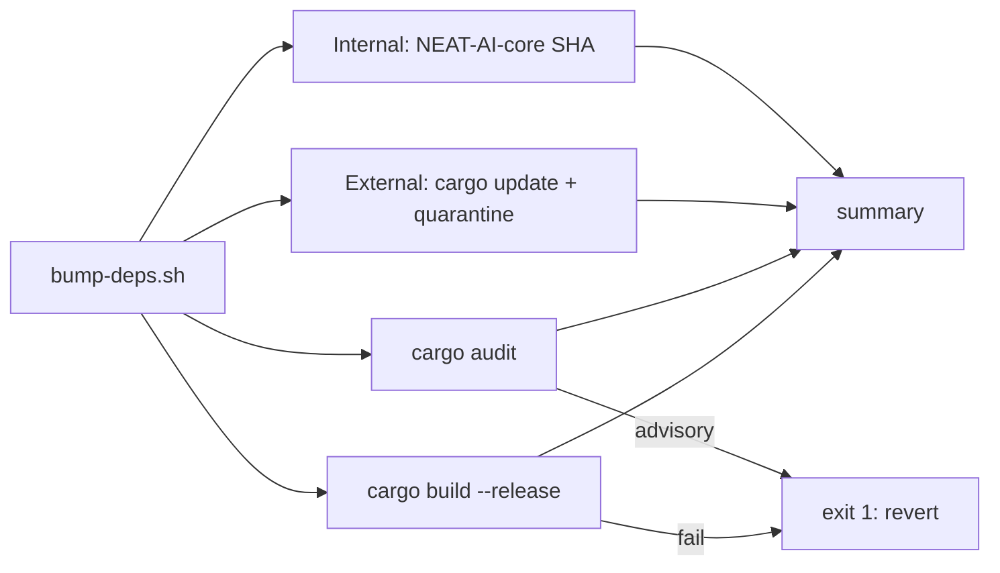

## Summary

Adds `bump-deps.sh` at the repo root, the pre-`quality.sh` Cargo dependency
refresher invoked by the Vibe Coder worker per stSoftwareAU/VibeCoding#1613.
The script runs four stages and prints a one-line summary:

1. **Internal — NEAT-AI-core pin.** Resolves `gh api repos/stSoftwareAU/NEAT-AI-core/commits/Develop --jq .sha` and rewrites the `rev = "..."` field in any workspace `Cargo.toml` that pins `neat-core` via `git+rev`. The current sibling-clone `path = "..."` layout has no SHA to advance, so this step is a no-op until someone switches to a `git+rev` pin.
2. **External — crates.io.** Parses `cargo update --dry-run`, queries crates.io for the publish time of each proposed bump, defers versions younger than `--quarantine-hours` (default `$VIBE_BUMP_QUARANTINE_HOURS` / 24h), and applies the rest with `cargo update -p <crate> --precise <new>`.
3. **`cargo audit`.** Fails non-zero on any reported advisory, naming the offending crate and advisory ID.
4. **`cargo build --release`.** Confirms the bumped tree compiles.

Exit `0` = clean (or no-op). Non-zero = the bump produced a non-passing tree; the worker reverts.

Closes #55.

## Evidence

CLI-only change — no UI to screenshot. The script was exercised end-to-end against the live repo (path-dep manifest, all stages skipped except internal):

```sh
$ ./bump-deps.sh --skip-external --skip-audit --skip-build
internal: NEAT-AI-core resolved via path dependency — no SHA pin to refresh
bump-deps: no bumps (internal=path dependency (no SHA pin); external=skipped; audit=skipped; build=skipped)
```

`./quality.sh` passes cleanly with the new script and tests in place — shellcheck, codespell, cargo-deny, fmt, clippy, check, test, doc, and release build all green.



## Test Plan

Added `tests/scripts/bump_deps.bats` (12 tests, all passing under `bats`):

- `--help` prints usage including the `--quarantine-hours` flag.
- Unknown options exit non-zero with an `unknown option` message.
- Non-integer `--quarantine-hours` is rejected before any work runs.
- **Internal pin — path dependency:** the live repo layout is reported as a no-op and the summary line says `no bumps`.
- **Internal pin — `git+rev` advance:** a fixture pinned to `1111…` is rewritten to `2222…` (override SHA via `--neat-core-sha`); the manifest content is verified afterwards.
- **Internal pin — already current:** an upstream SHA matching the pin produces `already pinned` and `no bumps`.
- **Internal pin — `[dependencies.neat-core]` section form:** the multi-line section variant is rewritten correctly.
- **All `--skip-*` flags:** the script runs with no work and emits the no-op summary.
- **`--check-published` helper:** ancient timestamps exit `0`, fresh timestamps exit `1`, `--quarantine-hours 0` always allows the bump, and unparsable timestamps surface a non-zero exit.

The bats suite is picked up automatically by `quality.sh` (`tests/scripts/*.bats`).

## Acceptance Criteria

- [x] `./bump-deps.sh` exists, is executable, and produces a clean PR-ready diff (or none) — script is `chmod +x` and runs hermetically when all stages are skipped.
- [x] Internal bump (NEAT-AI-core) advances the pin whenever upstream Develop has moved — covered by the `1111…` → `2222…` test plus the `[dependencies.neat-core]` section variant.
- [x] External bumps respect `VIBE_BUMP_QUARANTINE_HOURS` — `crate_published_at` + `is_older_than_hours` gate every bump; the env var is the default for `--quarantine-hours` and is exercised by the `--check-published` tests.
- [x] `cargo audit` failures cause exit non-zero with a clear message naming the offending crate + advisory ID — `run_audit` parses the `ID:` / `Crate:` block and emits `audit: FAILED — <crate> (<id>)`.
- [x] Release build passes against the bumped tree — `run_build` runs `cargo build --release --workspace` and reports the result in the summary.
