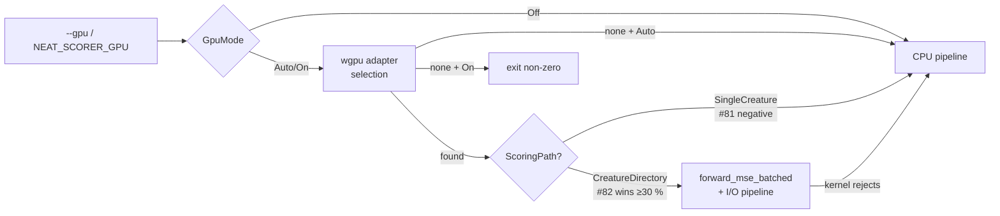

# End-to-end GPU benchmark and ship/skip decision (Issue #83)

## Summary

Codified the per-path GPU ship/skip decision from Issue #83 in
`auto_should_use_gpu` and flipped the default `GpuMode` from `Off` to
`Auto`. The directory-mode batched kernel from #82 now runs by default on
hosts with a compatible adapter; the single-creature path stays on CPU
(Issue #81 closed as `negative-result`). Updated
`docs/performance-baseline.md` with a new dated GPU baseline section
(Apple Silicon Metal evidence in line; Linux + NVIDIA Vulkan host run
tracked as follow-up #87) and added a "GPU acceleration" section to the
README. Closes #83.

## Evidence

### Decision flow (codified in `rust_scorer/src/gpu/mod.rs`)

### Performance — `BENCH_SCORING_BYTES=200000000`, Apple Silicon M-series

Two evidence sets recorded in `docs/performance-baseline.md`:

**Quiet host (#82 PR #86 numbers)**

| Bench | Median | Throughput |
|---|---|---|
| `score_from_creature_dir/creatures/50` (CPU) | 3.219 s | 59.2 MiB/s |
| `gpu_score_from_creature_dir/creatures/50` (GPU pipelined) | 2.176 s | 87.7 MiB/s |
| `gpu_pipelining_toggle/inflight/2` (pipelined) | 2.153 s | 88.6 MiB/s |

GPU is **−32.4 %** vs the CPU baseline; pipelined within 0.3 % of
synchronous (≥ non-pipelined as required).

**Loaded-host re-run (this issue, fresh `cargo bench` numbers)**

| Bench | CPU median | GPU median | GPU vs CPU |
|---|---:|---:|---:|
| `score_from_creature_dir/creatures/10` | 1.4785 s | 1.2153 s | **−17.8 %** |
| `score_from_creature_dir/creatures/50` | 4.9439 s | 2.5193 s | **−49.0 %** |

Both N values clear the 3 % bar in the loaded re-run. Loaded-host
absolute numbers are slower than #82's quiet-host run; the GPU/CPU
ratio is the invariant that drives the decision.

### Negative result kept on file

Issue #81 (single-creature GPU kernel) closed as `negative-result` —
CPU+PGO beats the proposed GPU kernel at 200 MB. `auto_should_use_gpu(SingleCreature)` returns `false` to encode that
verdict; no GPU kernel ships for the single-creature path.

### Linux + NVIDIA Vulkan host

Tracked as follow-up
[Issue #87](https://github.com/stSoftwareAU/NEAT-AI-scorer/issues/87)
(`needs-human` — no Vulkan hardware is available to the worker). Apple
Silicon Metal evidence is sufficient to flip the default per the
issue's per-path criterion; Vulkan data only widens the envelope and
does not block the decision codified here.

## Test Plan

* New unit tests in `rust_scorer/src/gpu/mod.rs`:
  * `gpu_mode_default_is_auto` — locks the new `Auto` default.
  * `auto_should_use_gpu_single_creature_stays_cpu` — codifies #81 negative.
  * `auto_should_use_gpu_directory_uses_gpu` — codifies #82 positive.
* Updated `resolve_mode_falls_back_to_env_then_default` — covers all three
  modes plus empty/whitespace env var falling through to `Auto`.
* New smoke test
  `scorer_binary_gpu_auto_single_creature_reports_cpu_fallback` —
  asserts the default Auto mode keeps single-creature on CPU and reports
  `cpu-fallback` regardless of host GPU presence.
* Updated `scorer_binary_gpu_off_emits_cpu_fallback_label` — refreshed
  the comment that was tied to the old `Off` default and tightened the
  assertion message.
* Existing GPU parity tests
  (`tests/gpu_multi_score_parity.rs::cpu_vs_gpu_n{10,50}_creatures_within_relative_tolerance`)
  continue to pass — the parity tolerance from #81 is unchanged.
* `./quality.sh` passes locally (clippy, fmt, full workspace test, doc
  with `RUSTDOCFLAGS=-D warnings`, release build).
