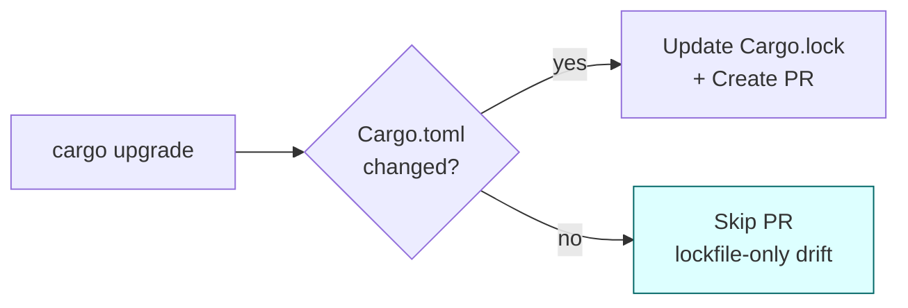

## Summary

PR #89 raised a "dependency upgrade" PR even though no `Cargo.toml`
manifest was actually advanced — only `Cargo.lock` drifted (a transitive
bump of `hashbrown 0.17.0 -> 0.17.1`). `cargo upgrade` refreshes the
lockfile to bring transitive deps up to date even when every available
bump is blocked by semver, so a lockfile-only diff is not a meaningful
upgrade. The weekly workflow now only opens a PR when at least one
`Cargo.toml` differs from `HEAD`. Closes #90.

### Change

Before this change, the trigger condition included `Cargo.lock` and
therefore fired in case `D`, producing the noise PR #89.

## Evidence

CLI-only change — no UI to screenshot. Behaviour is verified by the new
bats suite `tests/scripts/upgrade_dependencies_workflow.bats`, which
drives `scripts/check-upgrade-has-changes.sh` against synthetic git
repositories and asserts:

- A Cargo.lock-only diff reports `changed=false` (the PR #89
  regression case).
- A workspace-member `Cargo.toml` edit reports `changed=true`.
- A root `Cargo.toml` edit reports `changed=true`.
- A mixed Cargo.toml + Cargo.lock diff reports `changed=true`.
- A non-git directory yields a clear error message.

The full quality gate (`./quality.sh`) passes locally — shellcheck,
cargo-deny, fmt, clippy, full bats suite, rustdoc, and release build.

## Test Plan

- [x] `bats tests/scripts/upgrade_dependencies_workflow.bats` — 9
      assertions, all passing.
- [x] `./quality.sh < /dev/null` — clean.
- [x] Workflow YAML manually re-read: change-detection step now calls
      `scripts/check-upgrade-has-changes.sh` and no longer treats
      `Cargo.lock` as a meaningful trigger.
