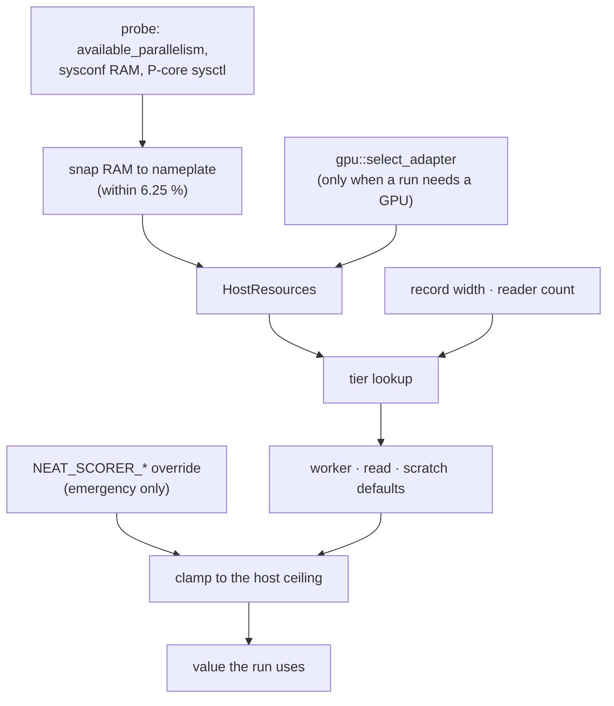

# Self-tuning reference — `rust_scorer`

How the scorer chooses every performance knob from the machine it is running
on: what it detects, which tier a host lands in, which knob each tier drives,
and what happens when a probe is unavailable. Settled by
[Issue #544](https://github.com/stSoftwareAU/NEAT-AI-scorer/issues/544) and its
sub-issues; this document is the single home for the mapping that used to live
implicitly across `host_resources.rs`, `read_tuning.rs`, `stream_score.rs` and
`gpu/forward_mse_batched.rs`.

## The policy

The scorer **self-tunes from detected hardware**. The `NEAT_SCORER_*` variables
are an **emergency escape hatch** — a diagnostic and incident lever — and
**not per-host configuration**:

- **No per-host recipes.** A host that needs an exported knob to perform is a
  tuning bug in `host_resources.rs` / `read_tuning.rs`, not a host that needs a
  wrapper script. Fix the tier, do not export the variable.
- **Detection over configuration.** Every default is a pure function of the
  probed CPU count, the nameplate RAM figure, the corpus record width, the
  concurrent reader count and — for the GPU scratch budget — the limits the
  selected adapter reports.
- **Evidence before a retune.** Moving a tier is a performance change and needs
  before/after numbers on the production scoring path (see the
  [Performance Task Workflow](../CONTRIBUTING.md#performance-task-workflow)).
  Three of the four #544 knobs measured *no* gain and shipped unchanged — see
  the [roll-up](#issue-544-roll-up) below.
- **Never silently.** A malformed override warns on stderr and falls back to
  the detected default (Issue #204); it never looks as though it took effect.



## What the probe detects

[`HostResources::probe`](../rust_scorer/src/host_resources.rs) runs once per
process and is read-only afterwards.

| Field | Probed from | When the probe fails |
|---|---|---|
| `cpus` | `std::thread::available_parallelism` | `1` — never zero |
| `performance_cpus` | macOS `hw.perflevel0.physicalcpu` → `hw.physicalcpu`; Linux highest-`cpu_capacity` tier | the logical count — **never fewer**, so an unclassifiable host keeps every historical default |
| `physical_ram_bytes` | `sysconf(_SC_PHYS_PAGES) × sysconf(_SC_PAGESIZE)`, snapped to nameplate | `None` — every tier then takes its mid-range branch |
| `gpu` | the adapter `gpu::select_adapter` already created — **never** a probe of its own | `None` — GPU knobs keep their RAM-derived value, so `--gpu off` and GPU-less hosts pay nothing |

The RAM probe reports **usable** memory, so a nominally 16 GB x86 Linux box
reads ≈ 15.5 GiB and would drop a whole tier. `snap_to_nameplate_bytes` rounds a
reading up to the nearest nameplate capacity when it sits within **6.25 %** of
it, once, at the single point `HostResources` is constructed (Issue #547) — so
every tier below compares against the capacity the machine was sold with. A
reading further below than that is left exactly as probed.

## Detection → tier → knob

Every table below is generated by a `match` on the snapped RAM figure, and
every one is checked against the shipped constants by
`scripts/check-self-tuning-docs.sh`.

### Worker ceiling

`host_resources::max_worker_count` — the hard cap on activation workers and
file readers, so a typo'd `NEAT_SCORER_ACTIVATION_THREADS=999` cannot spawn
more compiled-network clones than the machine can hold.

| Snapped RAM | `max_worker_count` | Why |
|---|---|---|
| < 2 GiB | 2 | a clone per worker has to fit |
| < 4 GiB | 4 | old / embedded hosts |
| < 8 GiB | 16 | low-RAM laptops |
| ≥ 8 GiB | 256 | large Macs are no longer stuck at the historical 64 |
| unknown | 64 | the historical mid-range ceiling |

The **default** worker count (`default_worker_count`) is the logical CPU count
under that ceiling — one activation worker per logical CPU on every fleet host.
It drives `NEAT_SCORER_ACTIVATION_THREADS` and, capped by the corpus file
count, `NEAT_SCORER_FILE_THREADS`. With `W` concurrent readers each reader gets
`activation_threads / W` activation workers (at least one), so the two
parallelism axes share one CPU budget.

`performance_cpus` is **reported but not spent**: keying the default off the
P-core count is a retune, and the A/B that would justify it was inconclusive
under fleet load (Issue #546; the decision is deferred to
[Issue #553](https://github.com/stSoftwareAU/NEAT-AI-scorer/issues/553)).

### Record-size tier

`read_tuning::default_training_read_bytes_for_readers` starts from the corpus
record width: production records (2461 inputs + 1 output = 9848 B) amortise
poorly at the small-record chunk.

| Record width | Starting chunk |
|---|---|
| < 8000 B | 2 MiB |
| ≥ 8000 B | 32 MiB |

A host with ≥ 64 GiB RAM starts large-record corpora at the full 64 MiB clamp
instead. Whatever is chosen — default or override — is clamped to 64 MiB
(`MAX_READ_BYTES`, flat on every host since Issue #549) and rounded down to a
whole number of records, so a chunk never splits a record.

### Read-chunk RAM ceiling

The second of the three bounds on the read chunk: never ask an old machine for
the production default.

| Snapped RAM | Ceiling |
|---|---|
| < 4 GiB | 2 MiB |
| < 8 GiB | 8 MiB |
| < 16 GiB | 16 MiB |
| ≥ 16 GiB | 64 MiB |
| unknown | record-size default |

### Aggregate read budget

The third bound. A multi-file corpus is read by one reader per CPU
(Issue #529), so the resident read buffer is `readers × chunk`, not one chunk:
`read_tuning::aggregate_read_budget_bytes` is what they hold **together**, and
each reader's share of it caps its own chunk.

| Snapped RAM | Budget |
|---|---|
| < 64 GiB | 64 MiB |
| ≥ 64 GiB | 256 MiB |
| unknown | 64 MiB |

Never more than **RAM / 16**, whichever tier applies — every fleet tier is
already well inside that share, so the divisor is the guard against a *future*
tier asking a small Mac for a corpus-evicting buffer.

The chunk each reader actually takes is the **smallest** of the three: the
record-size tier, the RAM ceiling, and its share of the aggregate budget, never
narrower than one whole record.

### GPU scratch budget

`host_resources::default_gpu_scratch_bytes` — the budget for the
`forward_mse_scratch` activation SSBO, which bounds the kernel's grid-stride
width `G_x`. The RAM tiering is the starting point on **every** host, including
the GPU-less ones (where the value is computed and never used):

| Snapped RAM | Budget |
|---|---|
| < 4 GiB | 64 MiB |
| < 8 GiB | 128 MiB |
| < 16 GiB | 256 MiB |
| ≥ 64 GiB | 1 GiB |
| unknown | 512 MiB |

A host between 16 and 64 GiB takes the same 512 MiB as the unknown-RAM row.

With an adapter sensed (Issue #548) that figure is only ever **tightened**:

- unified memory (Apple silicon, integrated GPUs) — additionally capped at
  **RAM / 16**, because the scratch buffer and the streamed corpus share one
  DRAM pool;
- discrete cards — additionally capped at **binding limit / 4**, because host
  RAM describes nothing about VRAM;
- both — hard-capped at `max_storage_buffer_binding_size` (the scratch
  activations are a single binding, so exceeding it is a validation error, not
  a slow run) and floored to a power of two, because the runner rounds its
  allocation up to one;
- `G_x` is separately clamped to `max_compute_workgroups_per_dimension`.

Sensing never *raises* the budget: doubling it measured 7.9 % **slower** on the
M4 Pro shallow scratch path, so only the clamp shipped
([`performance-baseline.md`](performance-baseline.md#gpu-capability-sensing--10-august-2026-issue-548)).

### Fallbacks when a probe is unavailable

| Missing signal | Behaviour |
|---|---|
| RAM probe (`None`) | mid-range branch of every tier: 64-worker ceiling, 512 MiB scratch, 64 MiB aggregate budget, record-size chunk uncapped by RAM |
| P-core sysctl / `cpu_capacity` | `performance_cpus == cpus`; no knob moves either way |
| No GPU adapter sensed | the RAM-derived scratch budget, unchanged from before Issue #548 — this is also what `--host-report` prints, because the report never creates an adapter |
| Corpus not record-aligned per file | one sequential reader, which takes the whole aggregate budget |
| Single-file corpus | one reader, as above |

## Fleet tier table

The machines the scorer runs on, from the fleet health dashboard, mapped onto
the tiers above. Read chunk is the **per-reader** chunk at production record
width (9848 B) on a corpus with at least as many shards as the host has CPUs
(production ships 26). Every row is pinned by
`host_resources::tests::every_fleet_tier_resolves_the_documented_knobs`, so a
resolver change fails the Rust suite before this table can drift.

| Fleet hosts | Logical CPUs | RAM (nameplate) | Workers / readers | Read chunk per reader | Aggregate budget | GPU scratch |
|---|---:|---:|---:|---:|---:|---:|
| Apple M1 / M2 / M3 | 8 | 8 GB | 8 | 8 380 648 B | 64 MiB | 256 MiB |
| Apple M2 | 8 | 16 GB | 8 | 8 380 648 B | 64 MiB | 512 MiB |
| Apple M1 Pro / M4 | 10 | 16 GB | 10 | 6 706 488 B | 64 MiB | 512 MiB |
| Apple M4 | 10 | 24 GB | 10 | 6 706 488 B | 64 MiB | 512 MiB |
| Apple M1 Max | 10 | 32 GB | 10 | 6 706 488 B | 64 MiB | 512 MiB |
| Apple M4 Pro | 12 | 24 GB | 12 | 5 583 816 B | 64 MiB | 512 MiB |
| Apple M2 Ultra | 24 | 64 GB | 24 | 11 177 480 B | 256 MiB | 1 GiB |
| x86 Linux (no adapter) | 4 | 8 GB (≈ 7.6 GiB probed) | 4 | 16 771 144 B | 64 MiB | 256 MiB |
| x86 Linux (no adapter) | 4 | 16 GB (≈ 15.5 GiB probed) | 4 | 16 771 144 B | 64 MiB | 512 MiB |
| x86 Linux (no adapter) | 8 | 16 GB (≈ 15.5 GiB probed) | 8 | 8 380 648 B | 64 MiB | 512 MiB |
| x86 Linux (no adapter) | 12 | 16 GB (≈ 15.4 GiB probed) | 12 | 5 583 816 B | 64 MiB | 512 MiB |

Notes on reading it:

- **Every fleet host is on the 256-worker ceiling** — including the 8 GB x86
  Linux boxes, which only reach it because their ≈ 7.6 GiB reading snaps to the
  8 GiB nameplate (Issue #547).
- **The read chunk narrows as cores go up**, because the readers divide one
  aggregate budget: 4 readers take 16 MiB each, 24 readers take ~10.7 MiB each
  out of the large-RAM budget. That is the buffer each reader has held since
  Issue #529; Issue #549 only moved the division upstream so the reported value
  matches it.
- **The x86 Linux scratch column is computed and unused** — those hosts sense
  no adapter, so nothing allocates it.
- **The scratch column is unchanged by adapter sensing** on every Apple row:
  Apple silicon reports a 4 GiB binding limit on every tier, and RAM / 16 is
  above the tier value everywhere in the fleet.
- To see a host's own answers, run `rust_scorer --host-report` on it — that is
  the diagnostic this table was assembled from
  ([README](../README.md#host-knob-report----host-report-issue-545)).

## Emergency escape hatches

These variables exist for incidents and diagnostics — reproducing a report,
bisecting a suspected tuning fault, or working around a detection bug until it
is fixed in the tier tables. **Setting one per host is not a supported
configuration mechanism**; a permanent need for one is a bug report against
this document's tables.

| Variable | Overrides | Notes |
|---|---|---|
| `NEAT_SCORER_READ_BYTES` | the per-reader read chunk | clamped to `[record_bytes, 64 MiB]`, record-aligned, and still divided across concurrent readers |
| `NEAT_SCORER_ACTIVATION_THREADS` | the activation worker count | clamped to `[1, max_worker_count]` |
| `NEAT_SCORER_FILE_THREADS` | the concurrent `.bin` reader count | clamped to `[1, min(files, max_worker_count)]`; `1` restores the single sequential reader. A **sampled** read shares the knob but is clamped to `[1, max_worker_count]` only — it splits files into record windows, so it is not capped by the file count |
| `NEAT_SCORER_SAMPLED_READ` | whether a sparse sample fetches only its own records | `off` restores the full sequential sweep + post-decode filter (NEAT-AI-Lamarck#123). Scores are bit-identical either way, so this is a way out of an I/O regression on an odd host, never a tuning choice |
| `NEAT_SCORER_GPU_SCRATCH_BYTES` | the scratch SSBO budget | still capped at the adapter's binding limit |
| `NEAT_SCORER_GPU` | the GPU mode (`auto`/`on`/`off`) | a **mode selector**, not a tuning knob — the `--gpu` CLI flag is the supported form and wins over the variable |

A malformed value warns and falls back to the detected default:

```text
[scorer] ignoring invalid NEAT_SCORER_READ_BYTES='2MB', using default 2097152
```

`--host-report` reports `"source": "env"` only for an override that was parsed
**and** honoured, so a rejected value is visible rather than assumed.

## Issue #544 roll-up

What each sub-issue shipped, the evidence behind it, and which halves are
recorded negative results.

| Sub-issue | Shipped | Evidence | Outcome |
|---|---|---|---|
| [#545](https://github.com/stSoftwareAU/NEAT-AI-scorer/issues/545) | `--host-report` (schema `neat-scorer-host-report/3`) and `scripts/bench-knob-sweep.sh` | [fleet knob baseline](performance-baseline.md#544-fleet-knob-baseline--10-august-2026-issue-545) | enabler — no default changed |
| [#546](https://github.com/stSoftwareAU/NEAT-AI-scorer/issues/546) | P-core sensing (`performance_cpus`), reported by `--host-report` | [performance-core probe](performance-baseline.md#performance-core-probe--10-august-2026-issue-546) | probe ships; the **worker retune is deferred** — the A/B was inconclusive under fleet load, tracked in [#553](https://github.com/stSoftwareAU/NEAT-AI-scorer/issues/553) |
| [#547](https://github.com/stSoftwareAU/NEAT-AI-scorer/issues/547) | nameplate RAM snapping at the single construction point | 8 GB and 16 GB x86 Linux readings from the fleet health dashboard | **shipped, tier-moving**: an 8 GB box gains the 256-worker ceiling and a 16 MiB read cap; a 16 GB box gains 32 MiB reads and 512 MiB scratch |
| [#548](https://github.com/stSoftwareAU/NEAT-AI-scorer/issues/548) | `GpuCapability` sensing plus the binding-size / RAM-share / workgroup clamps | [GPU capability sensing](performance-baseline.md#gpu-capability-sensing--10-august-2026-issue-548) | clamp ships; the **budget retune is a `negative-result`** — doubling the budget was 7.9 % slower on the M4 Pro, 4 of 4 interleaved pairs |
| [#549](https://github.com/stSoftwareAU/NEAT-AI-scorer/issues/549) | reader-count-aware read defaults, the named aggregate budget, and removal of the dead `≥ 64 GiB → 256 MiB` read ceiling | [read-chunk defaults vs the reader count](performance-baseline.md#read-chunk-defaults-vs-the-reader-count--10-august-2026-issue-549) | structure ships; the **chunk retune is a `negative-result`** — 32 MiB per reader was ~50 % slower, and no smaller size cleared this fleet's noise floor, so every tier keeps a byte-identical resident buffer |
| [#550](https://github.com/stSoftwareAU/NEAT-AI-scorer/issues/550) | this document, the fleet tier table and `scripts/check-self-tuning-docs.sh` | the tables above, pinned by the Rust and bats suites | documentation only |
| [#551](https://github.com/stSoftwareAU/NEAT-AI-scorer/issues/551) | — | — | **outstanding**: no x86 Linux fleet host is reachable from the unattended worker, so that tier has no captured neutral baseline |

Net effect on shipped defaults: **only Issue #547 moved a fleet host's knobs.**
Everything else either added detection the knobs do not yet spend, or measured
a retune and rejected it.

## Keeping this document honest

- `scripts/check-self-tuning-docs.sh` (in `./quality.sh`, and therefore in CI)
  reads the tier arms and constants out of `host_resources.rs` and
  `read_tuning.rs` and fails on any row that disagrees, on any `NEAT_SCORER_*`
  environment read in `rust_scorer/src` with no entry in the escape-hatch table
  above, and on `README.md` or `performance-baseline.md` losing the
  emergency-only wording.
- `host_resources::tests::every_fleet_tier_resolves_the_documented_knobs` pins
  the fleet tier table to the resolvers themselves.
- `scripts/check-read-bytes-docs.sh` (Issue #504) separately guards the
  README's own read-chunk section.
